<!--<p class="message">
  Hey there! This page is included as an example. Feel free to customize it for your own use upon downloading. Carry on!
</p>-->


<p class="message">
<strong>Objective:</strong> learn to use RStudio, a free and open-source integrated development environment (IDE) for R.
</p>


The [RStudio IDE cheat sheet](https://www.rstudio.com/wp-content/uploads/2016/01/rstudio-IDE-cheatsheet.pdf) gives a very complete and detailed overview of RStudio. Have a look at it.


## RStudio panes

### R console

Type for example
```r
x <- c(3, 34, 12 40)
```
in the console then press enter. You should get this result.

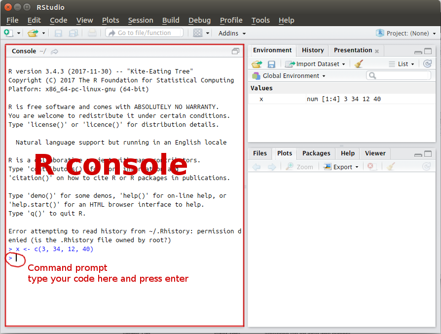

The "Environment" panel on the top right side shows all the variables already used.

To print the content of the variable `x`, type in the console
```r
x
```
then press enter.

### History pane
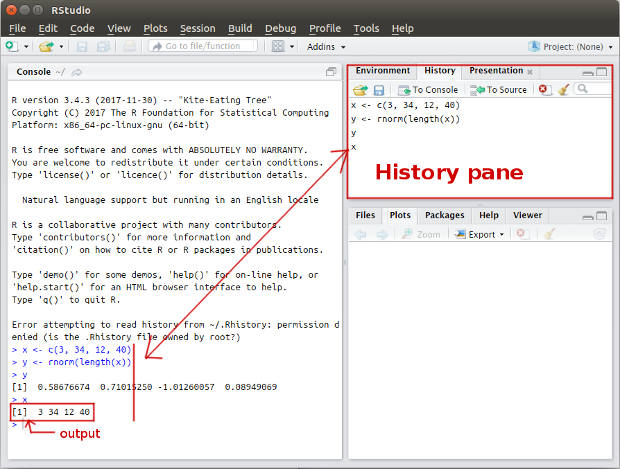


### Help pane
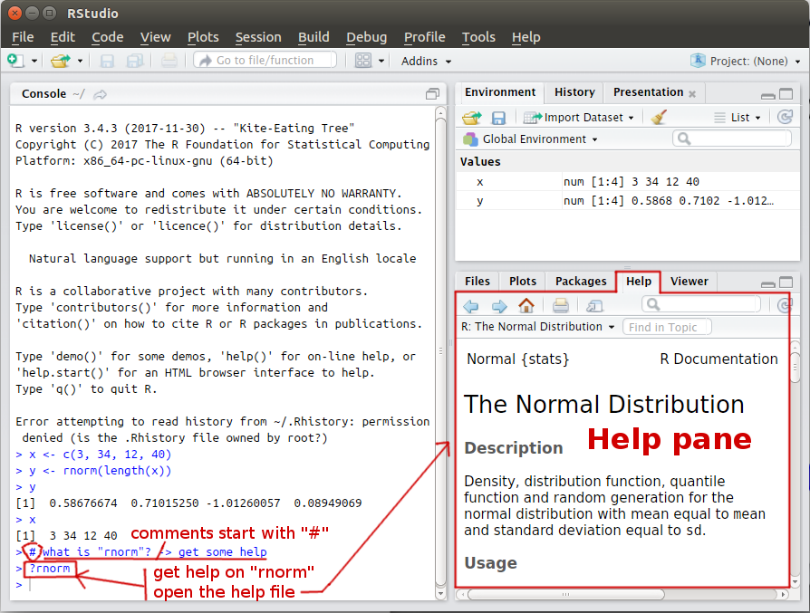


### Plot pane
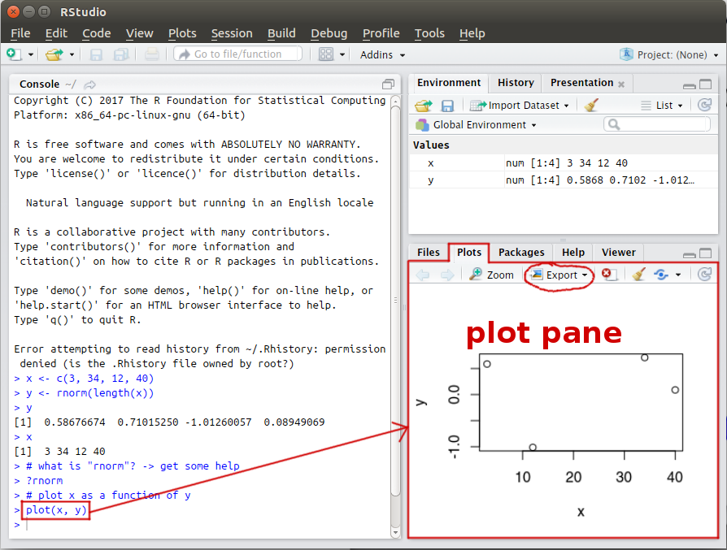


## Setting your working directory

To see what is your current working directory, type in the console
```r
getwd()    # get working directory
```
then press enter.

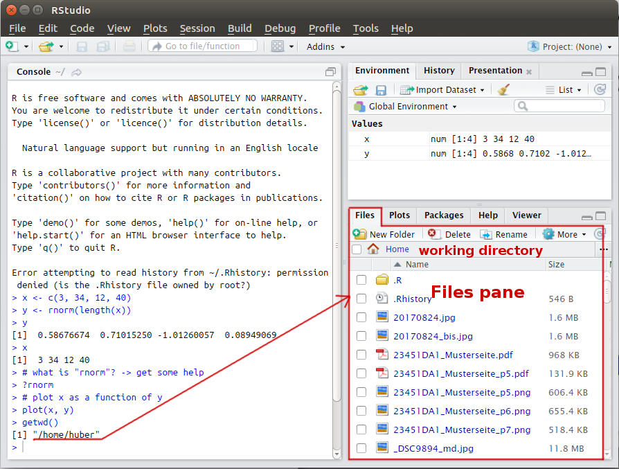


To set another working directory, type in the console
```r
setwd("YOUR_DIRECTORY")    # set working directory
```
then press enter. The variable `"YOUR_DIRECTORY"` is either:

* a relative path (e.g., `setwd("mysubfolder/run")`)
* or an absolute path (e.g., `setwd("C:/RCourse/mysubfolder/run")`).

**WARNING** You need to use the forward slash `/` as it is on Linux or Mac system. 
Alternatively, you can use the function `file.path` to correctly construct/assemble the file path:
```r
setwd(file.path("C:", "RCourse", "mysubfolder", "run"))
```

Then check if the path has been correctly set by typing `getwd()` in the console.
Notice that the files panel on the right changed!


You can also set the working directory through the menu interface of RStudio (see below):
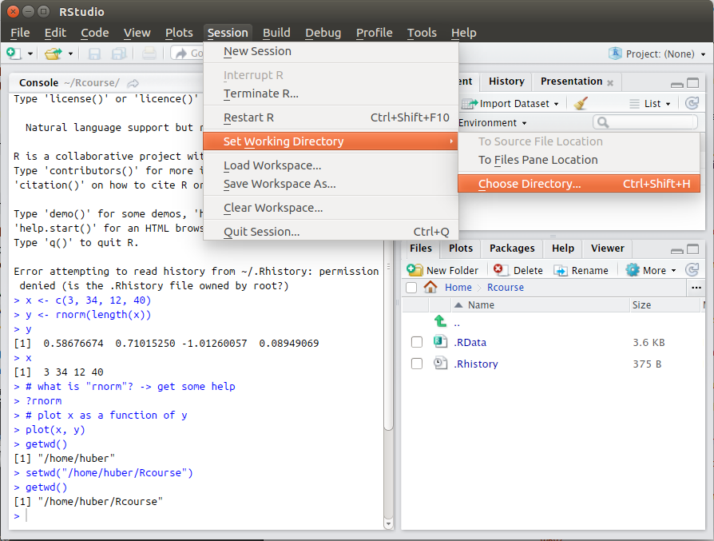


## Installing packages


R packages are collections of functions and data sets. The official R repository for package is the
[Comprehensive R Archive Network](https://cran.r-project.org/). You can:
- browse [all the 12133 available packages](https://cran.r-project.org/web/packages/available_packages_by_name.html) by name
- or browse packages by topic, see [CRAN task views](https://cran.r-project.org/web/views/)

Have a look at the documentation of the package `RConics`:
1. go to [https://cran.rstudio.com/web/packages/RConics/index.html](https://cran.rstudio.com/web/packages/RConics/index.html)
2. click on the link to the "reference manual" [RConics.pdf](https://cran.rstudio.com/web/packages/RConics/RConics.pdf)
Each function is documented (the function documentation is identical to the documentation displayed in the help panel in RStudio.


Packages can be installed by typing in the console
```r
install.packages(c("RConics", "plot3D"))
```
where `c("RConics", "plot3D")` is the vector of packages you want to install.

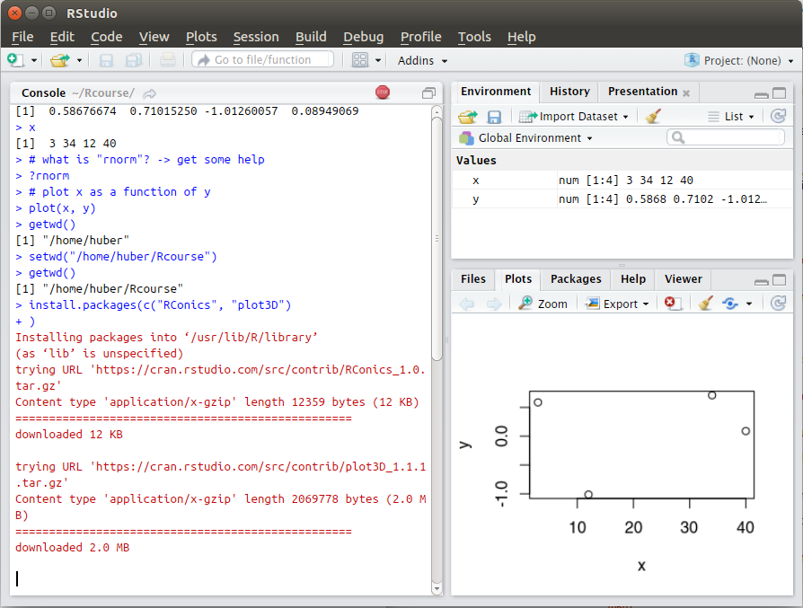

Alternatively, you can install a package through the menu interface of RStudio (see below):
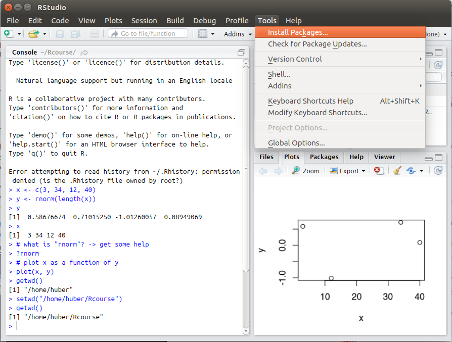
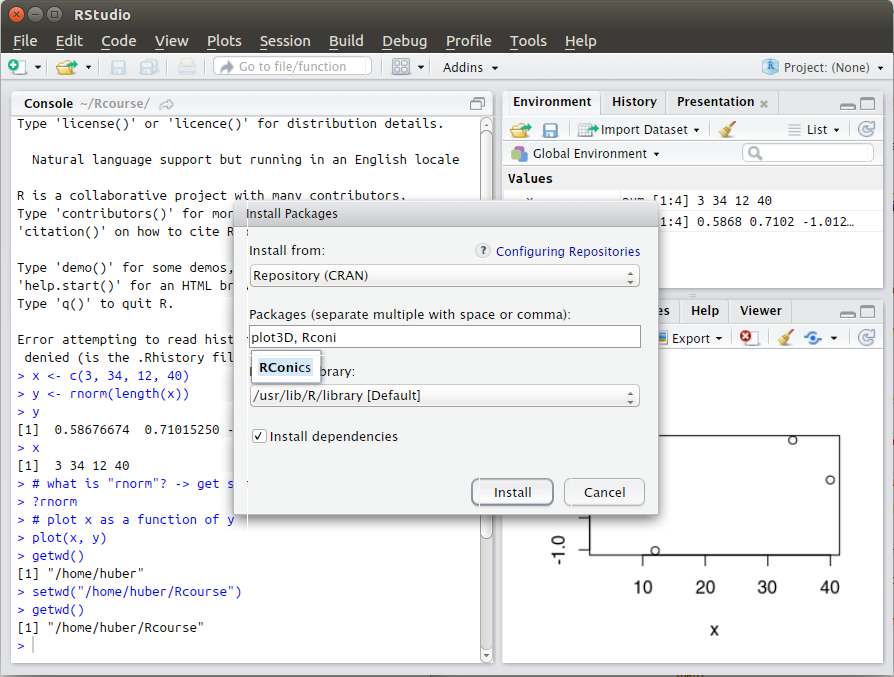

Once a package is installed, you need to load it in your current session to use it.
Load the packages `RConics` and `plot3D` with the function `library()`:
```r
library("RConics")
library("plot3D")
```
## Coding with RStudio
Normally you organise your code in a script file and then run it into the R console

### Creating a script file

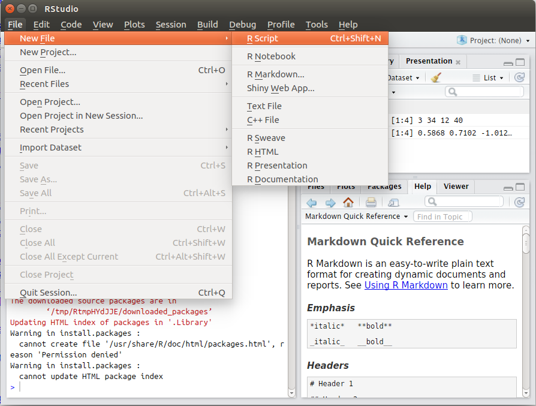
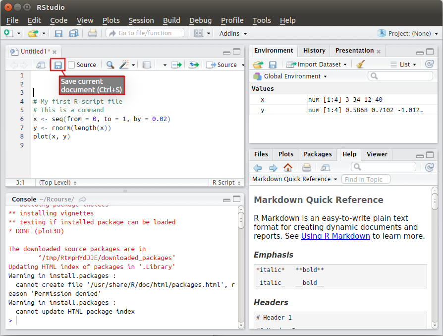

### Running the code
* Either use the "run" button:
    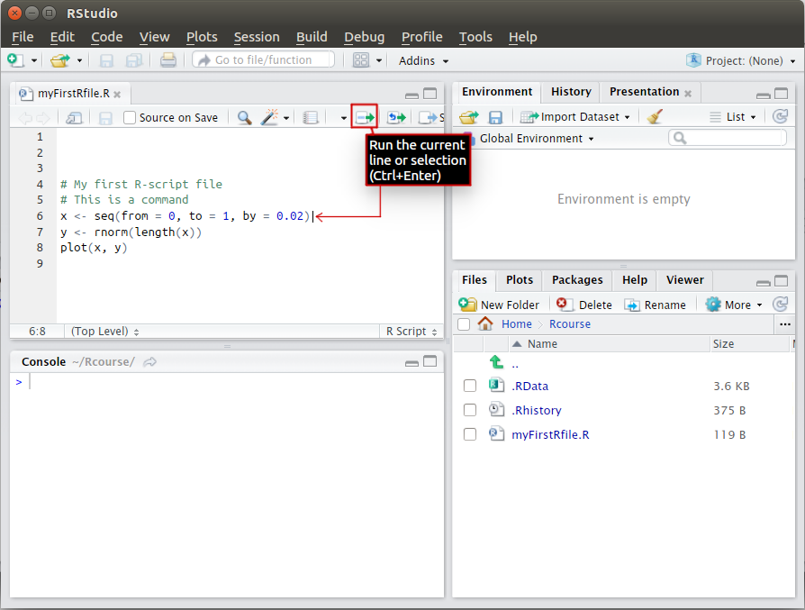

* or select the code to run and press `[Ctrl] + [Enter]`:
    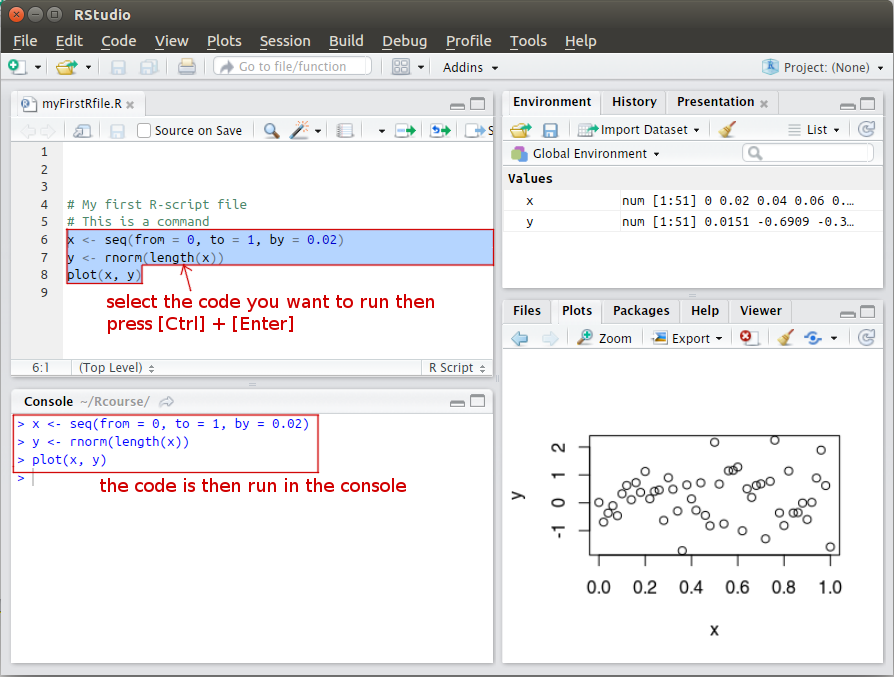


