GauProMod
================
Emanuel Huber
2025-11-02

R functions for Gaussian process (GP) modelling. The core functions are
coded in C++ and based on the EIGEN library (through RcppEigen)

## Notes

Currently implemented/to do:

- [x] Posterior Gaussian Process with Gaussian likelihood (Gaussian
  process conditioned to noise-free and noisy observations)
- [x] Space-time Gaussian process
- [x] Gaussian Process with monomial mean functions with vague Gaussian
  prior on the coefficient parameters.
- [x] Gaussian Process conditioned to derivative observations
- [x] Anisotropic covariance functions (scale and rotation)
- [x] Log marginal likelihood of the Gaussian process
- [x] Cross-matrix distance (distance between every rows of each
  matrix): `crossdist(x,y,M)` (with `M` a positive semidefinite matrix
  for anisotropic distances)
- [x] Covariance function: Matern, Gaussian, linear
- [ ] maximum likelihood hyper-parameter estimation
- [ ] McMC hyper-parameter sampling
- [ ] spatially varying covariance function
- [ ] Gaussian Process approximations (to deal with larger data set)
- [ ] add other covariance models

This is an ongoing project. If you have any questions, don’t hesitate to
contact me:

<emanuel.huber@alumni.ethz.ch>

Thank you!

## How to install/load

``` r
if(!require("devtools")) install.packages("devtools")
devtools::install_github("emanuelhuber/GauProMod")
```

## Short tutorial

### Load libraries

``` r
library(GauProMod)
library(plot3D)
library(RColorBrewer)
```

### 1D Gaussian Process Modelling

#### Observations and target

The observations are defined by a list with `x` the positions of the
observations and `y` the observed values. The targets are the positions
`x` where to simulate the Gaussian Process.

``` r
#observations
obs <- list(x=c(-4, -3, -1, 0, 4),
            y=c(-2,  0,  1, 2, 0))
# targets
targ <- list("x"=seq(-10,10,len=200))
```

#### Covariance function, mean function and likelihood

To build the covariance functions, the following kernels are available

``` r
# linear kernel
covModel <- list(kernel="linear",
                 b = 1,         # slope
                 h = 1.5,       # std. deviation
                 c = 0)         # constant
                 
# Matern kernel
covModel <- list(kernel="matern",
                 l = 1,       # correlation length
                 v = 2.5,     # smoothness
                 h = 2.45)    # std. deviation

# squared exponential kernel (Gaussian)
covModel <- list(kernel="gaussian",
                 l = 0.5,   # correlation length
                 h = 0.25)  # std. deviation
```

##### Covariance as a function of distance

``` r
covModel <- list(kernel="matern",
                 l = 5,     # correlation length
                 v = 1,     # smoothness
                 h = 2.45   # std. deviation
                )
r <- seq(0, 20, by = 0.1)
myCov <- covfx(r = r, covModel = covModel)
plot(r, myCov, type = "l", ylim = c(0, max(myCov)),
     ylab = "covariance", xlab = "distance", xaxs = "i", yaxs = "i")
```

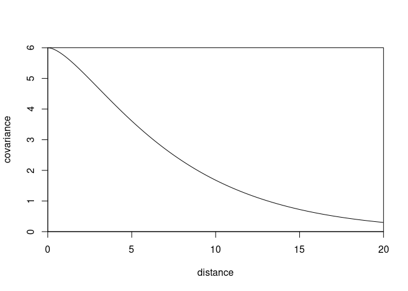<!-- -->

The following mean function (or basis functions) are available (see
Rasmussen and Williams (2006), Section 2.7):

``` r
# quadratic mean function
op <- 2
# linear mean function
op <- 1
# zero-mean function (no trend)
op <- 0 
```

Because nothing is perfectly observed, it makes sense to account for
uncertainty in the observation. Gaussian likelihood, defined by the
standard deviation `sigma` (erreur uncertainty) is the only form of
likelihood currently implemented in GauProMod. Sigma must be either a
length-one vector or has exactly the same length as the observations
values

``` r
# standard deviation measurement error
# Gaussian likelihood
sigma <- 0.2
# or
sigma <- abs(rnorm(length(obs$y)))
```

#### Conditional Gaussian Process modelling

``` r
GP <- gpCond(obs = obs, targ = targ, covModels=list(pos=covModel), 
               sigma = sigma, op = op)
names(GP)
# GP$mean   = mean value at location xstar
# GP$cov    = covariance matrix of the conditioned GP
# GP$logLik = log-likelihood of the conditioned GP
# GP$xstar  = x-coordinates at which the GP is simulated
```

Plot the mean function plus/minus the standard deviation

``` r
#--- plot mean +/- sd
xp <-(GP$mean + sqrt(diag(GP$cov)))  # mean + sd
xm <-(GP$mean - sqrt(diag(GP$cov)))  # mean - sd

# initialise the plot
plot(cbind(obs$x, obs$y), type="p", xlab="x", ylab="y", 
     xlim = range(c(obs$x, targ$x)), ylim = range(c(xp, xm, obs$y)),
     pch = 20, col = "black") 
lines(GP$xstar, GP$mean,col="red")  # mean
lines(GP$xstar, xm,lty=3)            # + sd
lines(GP$xstar, xp,lty=3)            # - sd
legend("topleft", legend = c("obs", "mean", "sd"), lty = c(NA, 1, 3),
       pch = c(20, NA, NA), col=c("black", "red", "black"), bty="n")
```

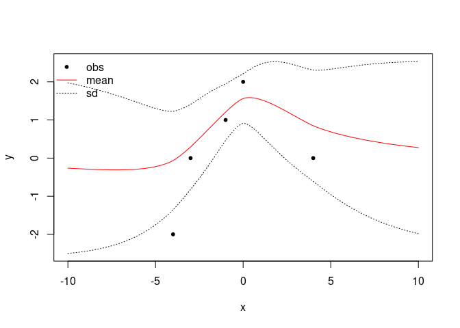<!-- -->

Random conditional simulation

``` r
# cholesky factorisation
L <- cholfac(GP$cov)
# random simulation
ystar <- gpSim(GP , L = L)
```

You can also directly use `ystar <- gpSim(GP)` without the argument `L`
(the Cholesky factor) but each time you will call `gpSim(GP)`, `gpSim`
will compute again internally the Cholesky factor. So, if you plan to
run many unconditional simulations, it is faster to first compute the
Cholesky factor and then run several time `gpSim` with the argument `L`.

Plot the random simulation:

``` r
plot(rbind(cbind(obs$x, obs$y), ystar), type="n", xlab="x", ylab="y") 
lines(ystar, col = "blue")
points(cbind(obs$x, obs$y), col = "black", pch = 20)
legend("topleft", legend = c("obs", "GP sim"), lty = c(NA, 1),
       pch = c(20, NA), col=c("black", "blue"), bty="n")
```

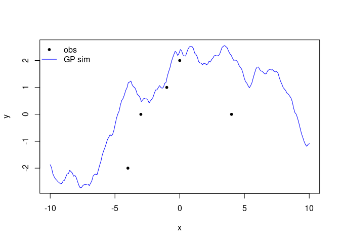<!-- -->

#### Conditional Gaussian Process modelling with derivatives

We define a new object `bc` (a list) defining the derivatives, with
elements:

- `x` the location of the derivative
- `y` the value of the derivative
- `sigma` the uncertainty (standard deviation) on the derivative value
  (`y`)

``` r
covModel <- list(kernel = "matern",
                 l = 0.25,
                 v = 3.5,
                 h = 0.55)

bc <- list(x = c(-4.5, -2, 0,  3, 4.5),
           y = c(   0,  1, 0, -1,   0),
           sigma = 0)

sigma <- 0.1

GP <- gpCond(obs = obs, targ = targ, covModels=list(pos=covModel), 
               sigma = sigma, op = 0)
GP2 <- gpCond(obs = obs, targ = targ, covModels=list(pos=covModel), 
               sigma = sigma, op = 0, bc = bc)


#--- plot mean +/- sd
xp <-(GP$mean + sqrt(diag(GP$cov)))  # mean + sd
xm <-(GP$mean - sqrt(diag(GP$cov)))  # mean - sd
xp2 <-(GP2$mean + sqrt(diag(GP2$cov)))  # mean + sd
xm2 <-(GP2$mean - sqrt(diag(GP2$cov)))  # mean - sd


plot(cbind(obs$x, obs$y), type="p", xlab="x", ylab="y", 
     xlim = range(c(obs$x, targ$x)), ylim = range(c(xp, xm, obs$y)),
     pch = 20, col = "black", main = "without derivatives") 
lines(GP$xstar, GP$mean,col="red")  # mean
lines(GP$xstar, xm,lty=3)            # + sd
lines(GP$xstar, xp,lty=3)            # - sd
legend("topleft", legend = c("obs", "mean", "sd"), lty = c(NA, 1, 3),
       pch = c(20, NA, NA), col=c("black", "red", "black"), bty="n")
```

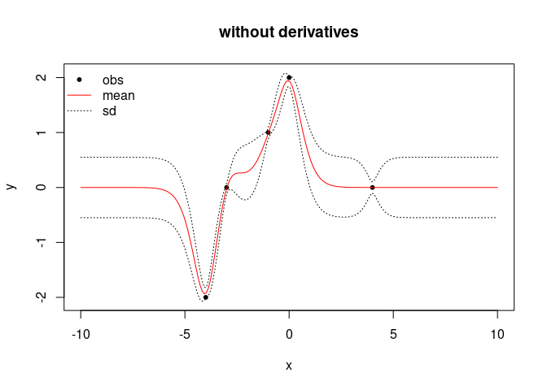<!-- -->

``` r
plot(cbind(obs$x, obs$y), type="p", xlab="x", ylab="y", 
     xlim = range(c(obs$x, targ$x)), ylim = range(c(xp, xm, obs$y)),
     pch = 20, col = "black", main = "with derivatives") 
lines(GP2$xstar, GP2$mean, col = "red")  # mean
lines(GP2$xstar, xm2,lty=3)            # + sd
lines(GP2$xstar, xp2,lty=3)            # - sd
legend("topleft", legend = c("obs", "mean", "sd"), lty = c(NA, 1, 3),
       pch = c(20, NA, NA), col=c("black", "red", "black"), bty="n")
y0 <- GP2$mean[sapply(bc$x, function(x, a) which.min(abs(x - a)), GP2$xstar)]
arrows(x0 = bc$x - 1/2, y0 = y0 - bc$y/2, 
       x1 = bc$x + 1/2, y1 = y0 + bc$y/2,
       length = 0.15, col = "dodgerblue2", lwd = 2)
```

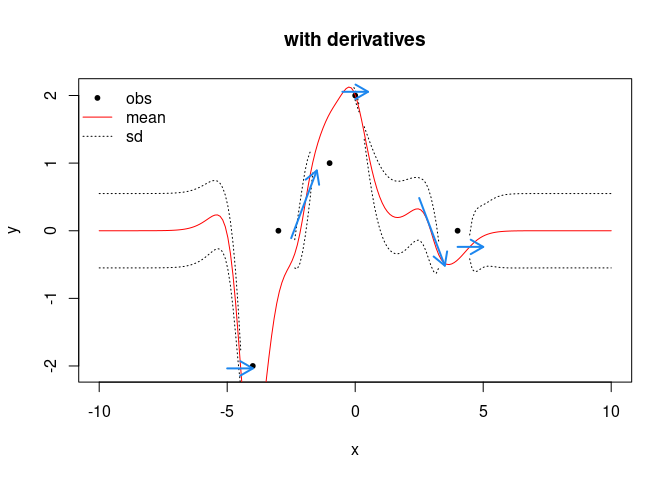<!-- -->

### Gaussian Process Modelling with two dimensional “positions”

To understand everything, please read the previous section (“1D Gaussian
Process Modelling”).

If you want to simulate a Gaussian process on a two-dimensional mesh, go
to the section “2D Gaussian Process Modelling (simulation on a 2D
mesh)”.

#### Observations and target

The observations are defined by a list with `x` the positions of the
observations and `y` the observed values. Here, the element `x` of the
observation list is a matrix corresponding to the coordinates of the
observations points (East/North coordinates or x/y coordinates).

``` r
#observations
obs <- list(x = cbind(c(2.17, 7.92, 8.98, 7.77, 2.79, 5.36, 4.27, 3.07, 6.31),
                     c(1.33, 7.24, 4.26, 2.67, 6.17, 8.04, 3.18, 5.63, 8.33)),
            y = c(2.60, 1.48, 1.36, 8.61, 1.00, 1.58, 8.42, 8.39, 1.50))
```

The target is defined by a two-columns matrix corresponding to the
coordinates of the target points.

``` r
# targets (=2D mesh)
targ <- list(x = cbind(c(2.17, 7.92, 8.98, 7.77, 2.79, 5.36, 4.27, 3.07, 6.31, 
                       3.74, 5.93, 7.19, 6.61, 5.54, 2.27, 1.61, 4.02, 1.06),
                     c(1.33, 7.24, 4.26, 2.67, 6.17, 8.04, 3.18, 5.63, 8.33,
                       6.34, 3.68, 6.82, 1.79, 8.60, 7.73, 5.35, 2.45, 4.92))
                      )
```

#### Covariance function, mean function and likelihood

To build the covariance functions, the same kernels as in the previously
defined are available:

``` r
# Matern kernel
covModel <- list(kernel="matern",
                 l = 5,     # correlation length
                 v = 1,     # smoothness
                 h = 2.45   # std. deviation
                )
```

Note that the 2D mean functions (or basis functions) are differently
defined:

``` r
# 2D quadratic mean function
op <- 5
# zero-mean function (no trend)
op <- 0 
# 2D linear mean function
op <- 2
```

Standard deviation (measurement error):

``` r
# Gaussian likelihood
sigma <- 0.2
```

#### Conditional Gaussian Process modelling

``` r
GP <- gpCond(obs = obs, targ = targ, covModels=list(pos=covModel), 
               sigma = sigma, op = op)
names(GP)
# GP$mean   = mean value at location xstar
# GP$cov    = covariance matrix of the conditioned GP
# GP$logLik = log-likelihood of the conditioned GP
# GP$xstar  = x-coordinates at which the GP is simulated
```

``` r
# mean
Ymean <- GP$mean
# standard deviation
YSD <- sqrt(diag(GP$cov))
ysdplus <- Ymean - 1.95* YSD
ysdminus <- Ymean + 1.95* YSD
```

#### Results

Plot the mean and standard deviation functions

Three-dimensional plot

``` r
par(mfrow = c(1,1))
ylim <- range(Ymean, obs$y)
plot3D::scatter3D(x = targ$x[,1], y = targ$x[,2], z = Ymean, clim = ylim, 
                  pch = 20)
plot3D::arrows3D(x0 = targ$x[,1], y0 = targ$x[,2], z0 = ysdminus, 
                 x1 = targ$x[,1], y1 = targ$x[,2], z1 = ysdplus,
                 length=0.05, angle=90, code=3, add = TRUE, col = "black")
# large dots = observations
plot3D::scatter3D(x = obs$x[,1], y = obs$x[,2], z = obs$y, add = TRUE, 
                  pch = 20, cex = 3, clim = ylim)
```

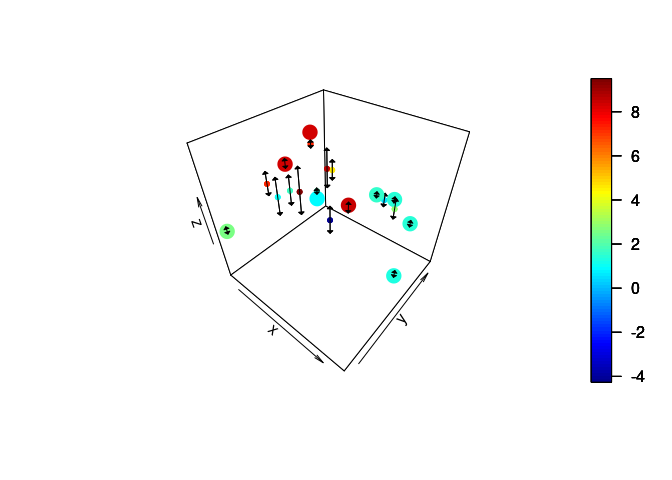<!-- -->

Pair of two-dimensional plots

``` r
par(mfrow = c(1, 2))
ylim <- range(ysdplus, ysdminus, obs$y)

plot(targ$x[,1], Ymean, type = "p", ylim = ylim, pch = 3, cex = 0.5)
arrows(targ$x[,1], ysdminus, targ$x[,1], ysdplus, length=0.05, angle=90, code=3)
points(obs$x[,1], obs$y, col = "dodgerblue", pch = 20)

plot(targ$x[,2], Ymean, type = "p", ylim = ylim, pch = 3, cex = 0.5)
arrows(targ$x[,2], ysdminus, targ$x[,2], ysdplus, length=0.05, angle=90, code=3)
points(obs$x[,2], obs$y, col = "dodgerblue", pch = 20)
```

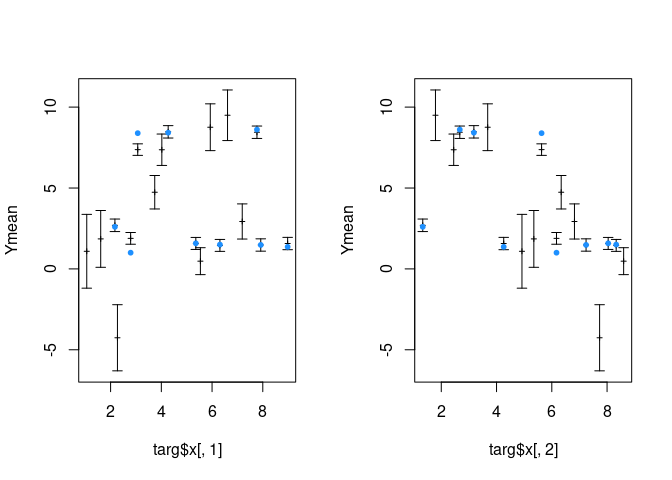<!-- -->

#### Random conditional simulation

``` r
L <- cholfac(GP$cov)
ystar <- gpSim(GP , L = L)

par(mfrow = c(1,1))
ylim <- range(ystar[,3], obs$y)
plot3D::scatter3D(x = targ$x[,1], y = targ$x[,2], z = ystar[,3], clim = ylim, 
                  pch = 18)
# dots = observations
plot3D::scatter3D(x = obs$x[,1], y = obs$x[,2], z = obs$y, add = TRUE, 
                  pch = 20, cex = 3, clim = ylim)
```

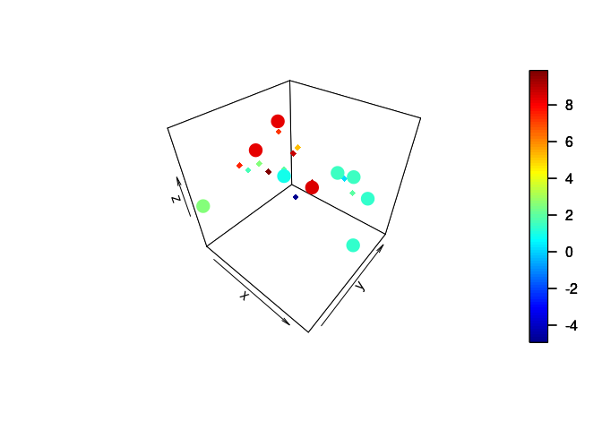<!-- -->

### 2D Gaussian Process Modelling (simulation on a 2D mesh)

To understand everything, please read the previous section (“1D Gaussian
Process Modelling”).

#### Observations and target

The observations are defined by a list with `x` the positions of the
observations and `y` the observed values. Here, the element `x` of the
observation list is a matrix corresponding to the coordinates of the
observations points (East/North coordinates or x/y coordinates).

``` r
#observations
obs <- list(x = cbind(c(2.17, 7.92, 8.98, 7.77, 2.79, 5.36, 4.27, 3.07, 6.31, 
                       3.74, 5.93, 7.19, 6.61, 5.54, 2.27, 1.61, 4.02, 1.06),
                     c(1.33, 7.24, 4.26, 2.67, 6.17, 8.04, 3.18, 5.63, 8.33,
                       6.34, 3.68, 6.82, 1.79, 8.60, 7.73, 5.35, 2.45, 4.92)),
            y = c(2.60, 1.48, 1.36, 8.61, 1.00, 1.58, 8.42, 8.39, 1.50, 
                  9.05, 1.14, 1.49, 9.19, 1.32, 1.03, 6.41, 6.16, 5.42))
```

The target is defined by a regular grid defined by two orthogonal
vectors. The function `vecGrid`returns a two-columns matrix
corresponding to the coordinates of each element of the grid.

``` r
# targets (=2D mesh)
vx <- seq(0, 10, by = 0.5)
vy <- seq(0, 10, by = 0.5)
targ <- list(x = vecGrid(vx, vy))
```

#### Covariance function, mean function and likelihood

To build the covariance functions, the same kernels as in the previously
defined are available:

``` r
# linear kernel
covModel <- list(kernel="linear",
                 b = 1,         # slope
                 h = 0.5,       # std. deviation
                 c = 1)         # constant
                 
# Matern kernel
covModel <- list(kernel="matern",
                 l = 1,       # correlation length
                 v = 2.5,     # smoothness
                 h = 2.45)    # std. deviation

# squared exponential kernel (Gaussian)
covModel <- list(kernel="gaussian",
                 l = 0.5,   # correlation length
                 h = 0.25)  # std. deviation
```

Note that the 2D mean functions (or basis functions) are differently
defined:

``` r
# 2D quadratic mean function
op <- 5
# zero-mean function (no trend)
op <- 0 
# 2D linear mean function
op <- 2
```

Standard deviation (measurement error):

``` r
# Gaussian likelihood
sigma <- 0.2
```

#### Conditional Gaussian Process modelling

``` r
GP <- gpCond(obs = obs, targ = targ, covModels=list(pos=covModel), 
               sigma = sigma, op = op)
names(GP)
# GP$mean   = mean value at location xstar
# GP$cov    = covariance matrix of the conditioned GP
# GP$logLik = log-likelihood of the conditioned GP
# GP$xstar  = x-coordinates at which the GP is simulated
```

Plot the mean and standard deviation functions

``` r
# mean
Ymean <- matrix(GP$mean, nrow = length(vx), ncol = length(vy), byrow = TRUE)
# standard deviation
YSD <- matrix(sqrt(diag(GP$cov)), nrow = length(vx), ncol = length(vy), 
              byrow = TRUE)
              
par(mfrow = c(2,2))
plot3D::image2D(x = vx, y = vy, z = Ymean, asp=1)
points(obs$x, col="white",pch=3)
title(main = "mean")

plot3D::contour2D(x = vx, y = vy, Ymean, asp=1)
points(obs$x, col="black",pch=3)
rect(vx[1], vy[1], vx[length(vx)], vy[length(vy)])
title(main = "mean")

plot3D::image2D(x = vx, y = vy, z = YSD, asp=1)
points(obs$x, col="white",pch=3)
title(main = "standard deviation")

plot3D::contour2D(x = vx, y = vy, YSD, asp=1)
points(obs$x, col="black",pch=3)
rect(vx[1], vy[1], vx[length(vx)], vy[length(vy)])
title(main = "standard deviation")
```

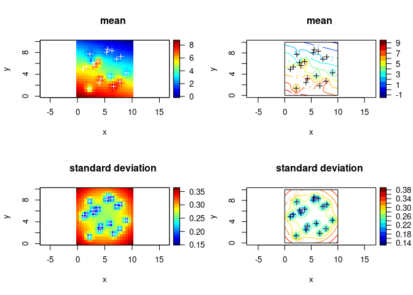<!-- -->

Random conditional simulation

``` r
L <- cholfac(GP$cov)
ystar <- gpSim(GP , L = L)

Ysim <- matrix(ystar[,3], nrow = length(vx), ncol = length(vy), byrow = TRUE)

par(mfrow=c(1,2))
plot3D::image2D(x = vx, y = vy, z = Ysim, asp=1)
points(obs$x, col="white",pch=3)


plot3D::contour2D(x = vx, y = vy, Ysim, asp=1)
points(obs$x, col="black",pch=3)
rect(vx[1], vy[1], vx[length(vx)], vy[length(vy)])
```

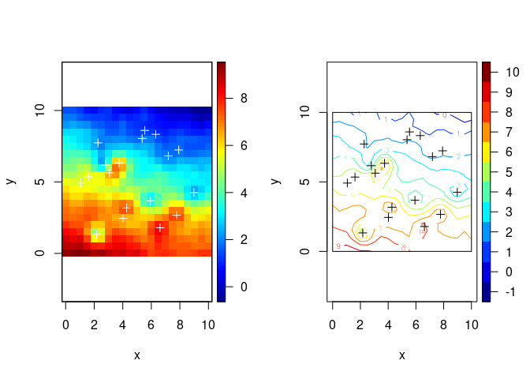<!-- -->

#### Anisotropy (scaling only along the coordinates axes)

``` r
covModelAni <- list(kernel="matern",
                 l = 1,       # correlation length
                 v = 2.5,     # smoothness
                 h = 2.45,
                 scale = c(1, 0.25))    # std. deviation
# 2D linear mean function
op <- 2

GP <- gpCond(obs = obs, targ = targ, covModels=list(pos=covModelAni), 
               sigma = sigma, op = op)
names(GP)
# GP$mean   = mean value at location xstar
# GP$cov    = covariance matrix of the conditioned GP
# GP$logLik = log-likelihood of the conditioned GP
# GP$xstar  = x-coordinates at which the GP is simulated
```

Plot the mean and standard deviation functions

``` r
# mean
YmeanAni <- matrix(GP$mean, nrow = length(vx), ncol = length(vy), byrow = TRUE)
# standard deviation
YSDAni <- matrix(sqrt(diag(GP$cov)), nrow = length(vx), ncol = length(vy), 
              byrow = TRUE)
              
par(mfrow = c(2,2))
plot3D::image2D(x = vx, y = vy, z = Ymean, asp = 1)
points(obs$x, col="white",pch=3)
title(main = "isotropic GP: mean ")

plot3D::contour2D(x = vx, y = vy, Ymean, asp = 1)
points(obs$x, col="black",pch=3)
rect(vx[1], vy[1], vx[length(vx)], vy[length(vy)])
title(main = "isotropic GP: mean")

plot3D::image2D(x = vx, y = vy, z = YmeanAni, asp = 1)
points(obs$x, col="white",pch=3)
title(main = "anisotropic GP: mean ")

plot3D::contour2D(x = vx, y = vy, YmeanAni, asp = 1)
points(obs$x, col="black",pch=3)
rect(vx[1], vy[1], vx[length(vx)], vy[length(vy)])
title(main = "anisotropic GP: mean")
```

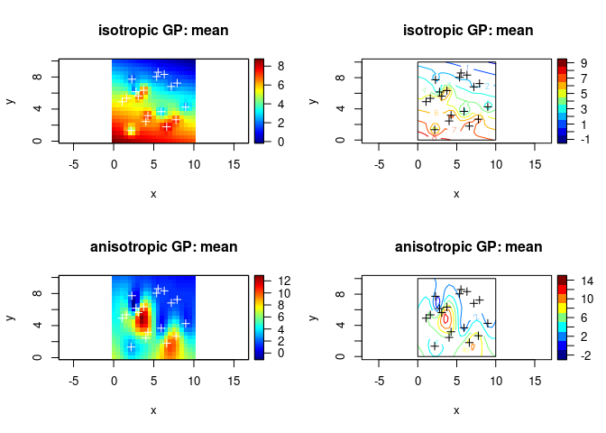<!-- -->

#### Anisotropy (scaling and rotation along the coordinates axes)

``` r
covModelAni2 <- list(kernel="matern",
                 l = 1,       # correlation length
                 v = 2.5,     # smoothness
                 h = 2.45,
                 scale = c(1, 0.25),
                 rot = c(1.0))    # std. deviation
# 2D linear mean function
op <- 2

GP <- gpCond(obs = obs, targ = targ, covModels=list(pos=covModelAni2), 
               sigma = sigma, op = op)
names(GP)
# GP$mean   = mean value at location xstar
# GP$cov    = covariance matrix of the conditioned GP
# GP$logLik = log-likelihood of the conditioned GP
# GP$xstar  = x-coordinates at which the GP is simulated
```

Plot the mean and standard deviation functions

``` r
# mean
YmeanAni2 <- matrix(GP$mean, nrow = length(vx), ncol = length(vy), byrow = TRUE)
# standard deviation
YSDAni2 <- matrix(sqrt(diag(GP$cov)), nrow = length(vx), ncol = length(vy), 
              byrow = TRUE)
              
par(mfrow = c(2,2))
plot3D::image2D(x = vx, y = vy, z = YmeanAni, asp = 1)
points(obs$x, col="white",pch=3)
title(main = "anisotropic GP (scale): mean ")

plot3D::contour2D(x = vx, y = vy, YmeanAni, asp = 1)
points(obs$x, col="black",pch=3)
rect(vx[1], vy[1], vx[length(vx)], vy[length(vy)])
title(main = "anisotropic GP (scale): mean")

plot3D::image2D(x = vx, y = vy, z = YmeanAni2, asp = 1)
points(obs$x, col="white",pch=3)
title(main = "anisotropic GP (scale + rotation): mean ")

plot3D::contour2D(x = vx, y = vy, YmeanAni2, asp = 1)
points(obs$x, col="black",pch=3)
rect(vx[1], vy[1], vx[length(vx)], vy[length(vy)])
title(main = "anisotropic GP (scale + rotation): mean")
```

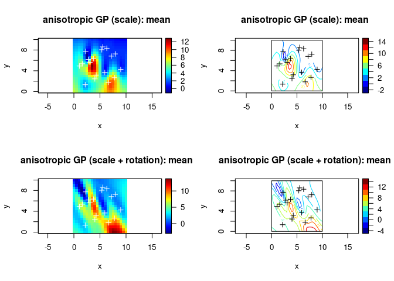<!-- -->

#### Gaussian process with derivative constraints

Interpolation of hydraulic heads that accounts for no-flow boundary
conditions at the top and bottom model boundary (adapted from Kuhlman
and Igúzquiz, 2010, <doi:10.1016/j.jhydrol.2010.01.002>).

We create a new object `bc` (a list) with elements

- `x` is the locations where we set the derivative of the Gaussian
  field,
- `v` the gradient derivative, i.e., a unit vector normal to the no-flow
  boundary (or tangent to a constant-head boundary)
- `y` is the value of the gradient (in this case `0` meaning that the
  gradient is flat)
- `sigma` the standard deviation reprensenting the uncertainty on the
  value of the gradient (i.e., `y`).

``` r
obs <- list(x = cbind(c(2.17, 7.92, 8.98, 7.77, 2.79, 5.36, 4.27, 3.07, 6.31),
                      c(1.33, 7.24, 4.26, 2.67, 6.17, 8.04, 3.18, 5.63, 8.33)),
            y = c(2.60, 1.48, 1.36, 8.61, 1.00, 1.58, 8.42, 8.39, 1.50))


# Matern kernel

vx <- seq(0, 10, by = 0.25)
vy <- seq(0, 10, by = 0.25)
targ <- list(x = vecGrid(vx, vy))


covModel <- list(kernel="matern",
                 l = 1,
                 v = 2.5,
                 h = 3)

op <- 5    
sigma <- 0.05


GP <- gpCond(obs = obs, targ = targ, covModels=list(pos=covModel), 
             sigma = sigma, op = op)
# mean
Ymean <- matrix(GP$mean, nrow = length(vx), ncol = length(vy), byrow = TRUE)

#  no-flow boundary top and bottom
bc <- list(x = cbind(c( rep(seq(0.5, 9.5, by = 2), 2)),
                     c(rep(0, 5), rep(10, 5))),
           v = cbind( rep(0, 10),
                      rep(1, 10) ),
           y =  rep(0, 10),
           sigma = 0) 


GPbc <- gpCond(obs = obs, targ = targ, covModels=list(pos=covModel), 
             sigma = sigma, op = op, bc = bc)
# mean
Ymeanbc <- matrix(GPbc$mean, nrow = length(vx), ncol = length(vy), byrow = TRUE)

par(mfrow = c(1,2))


plot3D::contour2D(x = vx, y = vy, Ymean, asp=1, nlevels = 20, col = "black", lwd = 2, 
                  xaxs = "i", yaxs = "i", labcex = 1)
points(obs$x, pch=20, col = "red", cex = 2)
#rect(vx[1], vy[1], vx[length(vx)], vy[length(vy)])
title(main = "mean GP")


plot3D::contour2D(x = vx, y = vy, Ymeanbc, asp=1, nlevels = 20, col = "black", lwd = 2, 
                  xaxs = "i", yaxs = "i", labcex = 1)
points(obs$x, pch=20, col = "red", cex = 2)
#rect(vx[1], vy[1], vx[length(vx)], vy[length(vy)])
title(main = "mean GP with no-flow\n boundaries")

points(bc$x, pch = 4)
arrows(bc$x[,1] - bc$v[,2]/2, bc$x[,2] - bc$v[,1]/2, 
       bc$x[,1] + bc$v[,2]/2, bc$x[,2] + bc$v[,1]/2,
       length = 0.15, col = "dodgerblue2", lwd = 2)
```

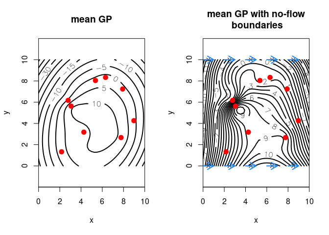<!-- -->

The same with:

- no-flow condition at top and bottom model boundaries
- constant-head boundary at left and right model boundaries

``` r
#  no-flow boundary top and bottom
bc2 <- list(x = cbind(c( rep(seq(0.5, 9.5, by = 2), 2),
                        rep(0, 5), rep(10, 5)),
                     c( rep(0, 5), rep(10, 5),
                        rep(seq(0.5, 9.5, by = 2), 2))),
           v = cbind( rep(0, 20),
                      rep(1, 20) ),
           y =  rep(0, 20),
           sigma = 0) 

GPbc2 <- gpCond(obs = obs, targ = targ, covModels=list(pos=covModel), 
             sigma = sigma, op = op, bc = bc2)
# mean
Ymeanbc2 <- matrix(GPbc2$mean, nrow = length(vx), ncol = length(vy), byrow = TRUE)

par(mfrow = c(1,2))


plot3D::contour2D(x = vx, y = vy, Ymeanbc, asp=1, nlevels = 20, col = "black", lwd = 2, 
                  xaxs = "i", yaxs = "i", labcex = 1, xlim = c(-0.5, 10.5))
points(obs$x, pch=20, col = "red", cex = 2)
title(main = "mean GP with no-flow\n boundaries")

points(bc$x, pch = 4)
arrows(bc$x[,1] - bc$v[,2]/2, bc$x[,2] - bc$v[,1]/2, 
       bc$x[,1] + bc$v[,2]/2, bc$x[,2] + bc$v[,1]/2,
       length = 0.15, col = "dodgerblue2", lwd = 2)

plot3D::contour2D(x = vx, y = vy, Ymeanbc2, asp=1, nlevels = 20, col = "black", lwd = 2, 
                  xaxs = "i", yaxs = "i", labcex = 1, xlim = c(-0.5, 10.5))
points(obs$x, pch=20, col = "red", cex = 2)
title(main = "mean GP with no-flow \n and cst head boundaries")

points(bc2$x, pch = 4)
arrows(bc2$x[,1] - bc2$v[,2]/2, bc2$x[,2] - bc2$v[,1]/2, 
       bc2$x[,1] + bc2$v[,2]/2, bc2$x[,2] + bc2$v[,1]/2,
       length = 0.15, col = "dodgerblue2", lwd = 2)
```

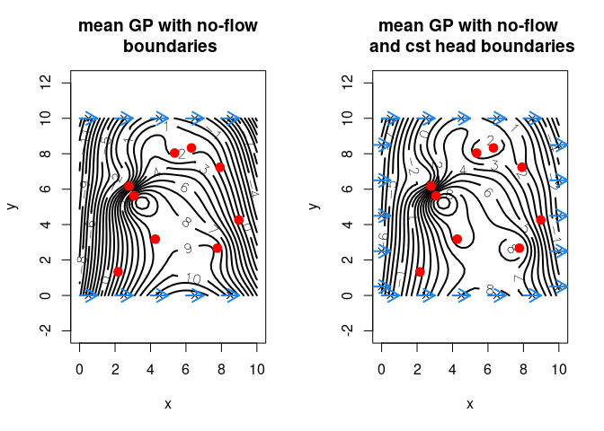<!-- -->

### Space-time Gaussian Process Modelling

To understand everything, please read the previous sections.

#### Observations and target

The observations are defined by a list with `x` the positions of the
observations, `y` the observed time-series and `t` the time scale. Note
that all the time-series must have the same time scale. Here, the
element `x` of the observation list is a matrix corresponding to the
coordinates of the observations points (East/North coordinates or x/y
coordinates).

The element `y` is a big vector constiting of all the time-series
recorded at the positions defined by element `x` put one after another.
For example, consider 5 monitoring stations with positions
x<sub>1</sub>, x<sub>2</sub>, x<sub>3</sub>, x<sub>4</sub> and
x<sub>5</sub>. At each station, a time-series was recorded:

- at station 1: **y**<sub>1</sub> = y<sub>1,1</sub>, y<sub>1,2</sub>, …,
  y<sub>1,t</sub>
- at station 2: **y**<sub>2</sub> = y<sub>2,1</sub>, y<sub>2,2</sub>, …,
  y<sub>2,t</sub>
- …
- at station 5: **y**<sub>5</sub> = y<sub>5,1</sub>, y<sub>5,2</sub>, …,
  y<sub>5,t</sub>

Then, the element `y` is set to c(**y**<sub>1</sub>, **y**<sub>2</sub>,
**y**<sub>3</sub>, **y**<sub>4</sub>, **y**<sub>5</sub>).

Assuming that the data were recorded every hour, the time scale `t` is
simply 1, 2, 3, …, t.

``` r
#observations
obs <- list(x = cbind(c(2, 8, 1, 3, 5),
                      c(9, 2, 3, 4, 6)),
            y = c(1:10 + rnorm(10, 0, 0.1),
                  1:10 + rnorm(10, -0.5, 0.1),
                  1:10 + rnorm(10, 1, 0.4),
                  1:10 + rnorm(10, -0.5, 0.2),
                  1:10 + rnorm(10, 0, 0.1)),
            t = seq_len(10))
```

The target is defined by a regular grid defined by two orthogonal
vectors. The function `vecGrid`returns a two-columns matrix
corresponding to the coordinates of each element of the grid. For each
element of the grid, the Gaussian process simulate a time-series whose
time scale is identical to that of the observations.

``` r
# targets
vx <- seq(0, 10, by = 0.5)
vy <- seq(0, 10, by = 0.5)
targ <- list(x = vecGrid(vx, vy))
```

#### Covariance function, mean function and likelihood

Two covariance are defined, one for the space domain (element `pos`) and
one for the time domain (element `time`). For the moment, the covariance
function of the space-time Gaussian process is defined by the product of
the spatial and temporal kernel.

``` r
covModels <- list(pos =  list(kernel="matern",
                              l = 4,       # correlation length
                              v = 2.5,     # smoothness
                              h = 2.45),    # std. deviation
                  time = list(kernel="gaussian",
                              l = 0.15,   # correlation length
                              h = 1.25))
                              
# 2D mean linear mean function 
op <- 2

# Gaussian likelihood
sigma <- 0.2
```

#### Conditional Gaussian Process modelling

``` r
GP <- gpCond(obs = obs, targ = targ, covModels = covModels, 
               sigma = sigma, op = op)
names(GP)
# GP$mean   = mean value at location xstar
# GP$cov    = covariance matrix of the conditioned GP
# GP$logLik = log-likelihood of the conditioned GP
# GP$xstar  = x-coordinates at which the GP is simulated
```

The mean values are re-organised into a three-dimensional array of
dimension \$n_t n_x n_y, with $n_t$ the number of time-step, and
$n_x \times n_y$ the dimension of the (spatial) target grid.

``` r
Ymean <-  array(GP$mean, dim=c(length(obs$t), length(vx), length(vy)))
Ysd <-  array(sqrt(diag(GP$cov)), dim=c(length(obs$t), length(vx), length(vy)))

par(mfrow = c(2,5))
for(i in seq_along(obs$t)){
  plot3D::image2D(z = Ymean[i,,], x = vx, y = vy, zlim = range(Ymean), 
                  main = paste("mean at t =",obs$t[i]))
  points(obs$x, col="white",pch=20, cex=2)
  points(obs$x, col="black",pch=3)
}
```

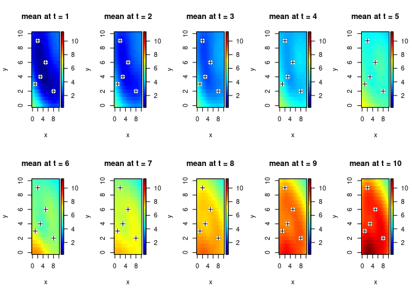<!-- -->

``` r
par(mfrow = c(2,5))
for(i in seq_along(obs$t)){
  plot3D::image2D(z = Ysd[i,,], x = vx, y = vy, zlim = range(Ysd), 
                  main =  paste("std. dev. at t =",obs$t[i]))
  points(obs$x, col="white",pch=20, cex=2)
  points(obs$x, col="black",pch=3)
}
```

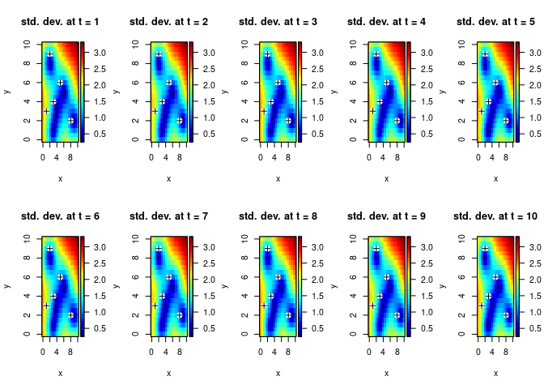<!-- -->

Random conditional simulation. La function `gpSim` returns a matrix
whose two first column correspond to the position coordinate, the third
columns corresponds to the time scale and the fourth column to the
simulated Gaussian process.

``` r
L <- cholfac(GP$cov)
ystar <- gpSim(GP , L = L)

colnames(ystar) <- c("x1", "x2", "t", "y")

Ysim <- array(ystar[,"y"], dim=c(length(obs$t), length(vx), length(vy)))

par(mfrow = c(2,5))
for(i in seq_along(obs$t)){
  plot3D::image2D(z = Ysim[i,,], x = vx, y = vy,
                  zlim = range(ystar[,"y"]), 
                  main = paste("simulation at t =",obs$t[i]))
  points(obs$x, col="white",pch=20, cex=2)
  points(obs$x, col="black",pch=3)
}
```

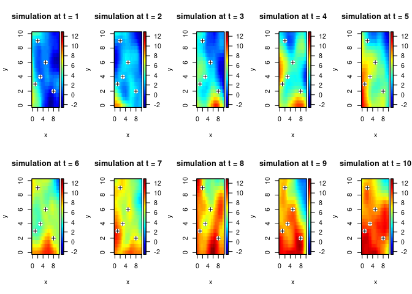<!-- -->

Time-series at location (4,1):

``` r
par(mfrow = c(1,1))
plot(Ysim[,vx == 4, vy == 1], type = "l", xlab = "time", ylab = "value")
```

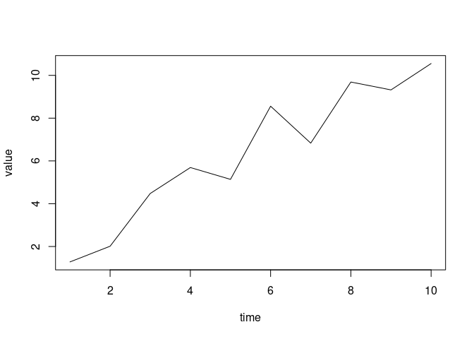<!-- -->

## References

Rasmussen C.E. and Williams C.K.I. (2006), Gaussian Processes for
Machine Learning, the MIT Press, ISBN 026218253X.
www.GaussianProcess.org/gpml


## Notes

* Kernel:

  * **linear** (implemented as the triangular / linear taper: $K(r)=\sigma^2\max(0,1-r/\ell)$ — commonly called the triangular or linear covariance in spatial literature).
  * **cauchy**: $K(r)=\sigma^2\big(1+(r/\ell)^2\big)^{-\nu}$.
  * **spherical**: compactly supported spherical model: for $r\le \ell$,
    $K(r)=\sigma^2\big(1-\tfrac{3}{2}(r/\ell)+\tfrac{1}{2}(r/\ell)^3\big)$, else 0.
* **Polynomial** and **Linear (dot-product)** kernels are *intrinsically dot-product kernels*, i.e. they depend on inner products (x^\top y), not on distances alone. Because your API supplies a distance matrix `R` (not a Gram matrix), it is **not possible** to compute the standard polynomial or linear dot-product kernels from `R` alone.
  To handle that, I added separate exported functions that accept a Gram (inner-product) matrix `G`:

  * `kLinearGram_rcpp(G, h, c, use_symmetry)` implements the linear dot-product kernel: $K(x,y)=\sigma^2 (x^\top y + c)$.
  * `kPolynomialGram_rcpp(G, h, degree, c, use_symmetry)` implements the polynomial kernel: $K(x,y)=\sigma^2 (x^\top y + c)^{p}$.
* For all distance-based kernels I implemented `d=0,1,2` handling following the *same sign/convention* as your original Gaussian/Matern code:

  * `d==0`: kernel value (K(r)).
  * `d==1`: returns `w * (- dK/dr)` (this matches your Gaussian and Matern implementations where the returned expression equals the negative radial derivative multiplied by `w`).
  * `d==2`: returns `- d^2K/dr^2` (the negative second radial derivative) — where meaningful, and for some compact models that have piecewise polynomials (like spherical/triangular) the exact formulas were used inside the compact support; for points where derivatives are not defined (at boundaries) the code uses the analytic interior derivatives (these are the same conventions used for Gaussian above).

Important note about conventions & derivatives

* I followed the *same derivative convention* you used for Gaussian and Matern: `d==1` returns `w * (-dK/dr)` and `d==2` returns `-d^2K/dr^2` (mapped into the same "directional weight" form you used earlier for Gaussian). That means the new kernels will plug into your existing pipeline without changing how `w` is used.
* For compactly supported kernels (spherical and triangular/linear) I used the analytic interior derivatives; at the range boundary (r=\ell) derivatives are not smooth — the code returns the interior analytic derivatives (consistent with many spatial implementations). If you want to treat boundary derivatives differently (e.g. set them to 0 or use one-sided limits) tell me and I’ll change it.

Usage notes and examples

* Distance-based kernels (Gaussian, Matern, Cauchy, Spherical, LinearDistance) keep the same API you already used: pass `R` (pairwise distances), `W` (weights used in your derivative formulas), `l`, `h`, `v` (used as shape for Cauchy/Matern), `d` (0,1,2) and `use_symmetry`.
* For dot-product kernels:

  * Use `kLinearGram_rcpp(G, h, c, use_symmetry)` when you already have the Gram matrix (G = X X^\top). `c` is the offset (commonly 0 or 1).
  * Use `kPolynomialGram_rcpp(G, h, degree, c, use_symmetry)` for polynomial kernel. `degree` must be integer (passed as double for API convenience).
* Example R workflow:

  * If you have data `X` (n x p), compute `G <- X %*% t(X)` and call `kPolynomialGram_rcpp(G, h=1.0, degree=3, c=1, TRUE)`.
  * If you have only pairwise distances `R` and want a polynomial kernel you must either reconstruct dot-products (need individual norms) or compute Gram directly from `X`.

Perfect! Here’s a fully documented **RcppEigen version of your linear (Gram) kernel** with derivative support (`d = 0, 1, 2`) and optional symmetry. The derivatives follow the usual convention from your other kernels:

* `d = 0`: $K(X, Y) = h^2 (X Y^T) + b^2$
* `d = 1`: derivative w.r.t each entry — for a linear kernel, this is constant, so we return a matrix of `h^2` scaled by `w`
* `d = 2`: second derivative is zero

Great! Let’s do the **polynomial (Gram) kernel** next. We’ll follow the same style as the linear kernel, support derivatives `d = 0, 1, 2`, optional symmetry, and allow a bias term `c` as in your R code.

The polynomial kernel formula:

$$
K(X, Y) = h^2 \cdot (X Y^\top + c)^{\text{degree}}
$$

Derivative conventions:

* `d = 0`: kernel values.
* `d = 1`: first derivative w.r.t entries: $ dK/dr = h^2 \cdot \text{degree} \cdot (X Y^\top + c)^{\text{degree}-1} $, multiplied elementwise by `w`.
* `d = 2`: second derivative: $ d^2 K/dr^2 = h^2 \cdot \text{degree} \cdot (\text{degree}-1) \cdot (X Y^\top + c)^{\text{degree}-2} $, multiplied elementwise by `w`.


The provided Rcpp function, `kCauchy_rcpp_fast`, appears **mathematically correct** for implementing the Cauchy kernel and its first two derivatives with respect to the distance $r$ (represented by `R.array()`), weighted by $w$ (represented by `W.array()`), based on the standard form of the **Cauchy kernel (or Rational Quadratic kernel)**.

The function computes the kernel $K(r)$ and related quantities for three cases of derivative order $d$:

---

## 1. Cauchy Kernel Formula

The **Cauchy kernel** (where $r$ is the distance) is generally defined as:
$$K(r) = h^2 \left(1 + \frac{r^2}{l^2}\right)^{-\nu}$$
Where:
* $r$ is the distance (from `R`)
* $l > 0$ is the length-scale (`l`)
* $h \ge 0$ is the marginal standard deviation scale (`h`)
* $\nu > 0$ is the smoothness parameter (`nu`)

---

## 2. Derivative Analysis

The code correctly implements $K(r)$ for $d=0$ and the derivatives for $d=1$ and $d=2$ based on the chain rule, where $u = r^2/l^2$.

### Case $d=0$ (Kernel $K$)

The formula implemented:
$$K(r) = h^2 \left(1 + \frac{r^2}{l^2}\right)^{-\nu}$$
**Code line:** `Eigen::ArrayXXd arr = h_sq * base.pow(-nu);`
* This is **correct**.

### Case $d=1$ (Weighted First Derivative: $w \cdot (-\frac{dK}{dr})$)

The first derivative is:
$$\frac{dK}{dr} = h^2 \cdot (-\nu) \left(1 + \frac{r^2}{l^2}\right)^{-\nu-1} \cdot \left(\frac{2r}{l^2}\right)$$
$$\frac{dK}{dr} = - h^2 \cdot \left(\frac{2\nu r}{l^2}\right) \left(1 + \frac{r^2}{l^2}\right)^{-\nu-1}$$

The code computes $w \cdot (-\frac{dK}{dr})$, where $w$ is from `W`:
$$w \cdot (-\frac{dK}{dr}) = w \cdot \left[ h^2 \cdot \left(\frac{2\nu r}{l^2}\right) \left(1 + \frac{r^2}{l^2}\right)^{-\nu-1} \right]$$
**Code line:** `Eigen::ArrayXXd arr = w_arr * (h_sq * (2.0 * nu) * r_arr / l_sq) * base.pow(-nu - 1.0);`
* This is **correct**.

### Case $d=2$ (Negative Second Derivative: $-\frac{d^2K}{dr^2}$)

The second derivative $\frac{d^2K}{dr^2}$ involves the product rule on the $\frac{dK}{dr}$ formula (with $C = \frac{2 \nu h^2}{l^2}$):
$$\frac{dK}{dr} = -C \cdot r \cdot \left(1 + \frac{r^2}{l^2}\right)^{-\nu-1}$$
$$\frac{d^2K}{dr^2} = -C \left[ \frac{d}{dr}(r) \cdot \left(1 + \frac{r^2}{l^2}\right)^{-\nu-1} + r \cdot \frac{d}{dr}\left(\left(1 + \frac{r^2}{l^2}\right)^{-\nu-1}\right) \right]$$
$$\frac{d^2K}{dr^2} = -C \left[ \left(1 + \frac{r^2}{l^2}\right)^{-\nu-1} + r \cdot \left((-\nu-1) \left(1 + \frac{r^2}{l^2}\right)^{-\nu-2} \cdot \left(\frac{2r}{l^2}\right)\right) \right]$$
$$\frac{d^2K}{dr^2} = \left[-C \left(1 + \frac{r^2}{l^2}\right)^{-\nu-1}\right] + \left[C \left(\frac{2r^2}{l^2}\right) (\nu+1) \left(1 + \frac{r^2}{l^2}\right)^{-\nu-2}\right]$$

The code implements $\frac{d^2K}{dr^2}$ as `d2`:
* $C = \frac{2 \nu h^2}{l^2}$
    **Code line:** `double C = (2.0 * nu * h_sq) / l_sq;` (Correct)
* Term 1: $-C \left(1 + \frac{r^2}{l^2}\right)^{-\nu-1}$
    **Code line:** `double term1 = -C * base.pow(-nu - 1.0);` (Correct)
* Term 2: $C \left(\frac{2r^2}{l^2}\right) (\nu+1) \left(1 + \frac{r^2}{l^2}\right)^{-\nu-2}$
    **Code line:** `Eigen::ArrayXXd term2 = C * ((2.0 * r_arr.square()) / l_sq) * (nu + 1.0) * base.pow(-nu - 2.0);` (Correct)

The final result is `arr = -d2`, which returns $-\frac{d^2K}{dr^2}$. This is consistent with common practice in some fields (like Gaussian Process regression) where the Hessian is used for uncertainty, and a positive definite covariance matrix may be preferred.
* This is also **correct** based on the comment `// return -d2K/dr2`.

---

## 3. Implementation Details

The C++ / Eigen / Rcpp implementation details are also sound:

1.  **Input Checks:** The checks for identical dimensions of `R` and `W`, the square requirement for `use_symmetry`, and the constraints $l > 0$ and $h \ge 0$ are all **correct** and robust.
2.  **Vectorization:** Using `Eigen::ArrayXXd` for element-wise operations (`.square()`, `.pow()`, arithmetic) is the **correct and fast** way to perform vectorized calculations in Eigen, fulfilling the function's name and purpose.
3.  **Symmetry:** Applying the average `K = (K + K.transpose()) * 0.5` when `use_symmetry` is true is the standard way to enforce numerical symmetry in kernel matrices, which is **correct** for a symmetric kernel like Cauchy, where $K(r_{ij}) = K(r_{ji})$.


I can explain **why** the first derivative result is often used as $w \cdot (-\frac{dK}{dr})$ if that context would be helpful!


This is a great request\! Implementing the **Matérn covariance function** in RcppEigen, especially for a general smoothness parameter $\nu$, is an excellent way to leverage C++ performance.

The Matérn correlation function $C(d)$ for distance $d$ is:

$$C(d) = \frac{1}{\Gamma(\nu) 2^{\nu-1}} \left( \frac{\sqrt{2\nu} d}{\rho} \right)^\nu K_\nu \left( \frac{\sqrt{2\nu} d}{\rho} \right)$$

where:

  * $d = ||\mathbf{x}_i - \mathbf{x}_j||$ is the Euclidean distance between two points $\mathbf{x}_i$ and $\mathbf{x}_j$.
  * $\rho > 0$ is the **range parameter** (or length-scale).
  * $\nu > 0$ is the **smoothness parameter**.
  * $\Gamma(\cdot)$ is the **Gamma function**.
  * $K_\nu(\cdot)$ is the **Modified Bessel function of the second kind** of order $\nu$.

The key to general $\nu$ is the availability of the **Modified Bessel function $K_\nu$** in C++. Since it is not standard in the C++ math library, we'll use the special functions available through the `R::bessel_k` function (part of the R API that can be called from Rcpp code).

That's an excellent question! Understanding $\Gamma(\nu)$ and $K_\nu(\cdot)$ is key to grasping how the **smoothness parameter $\nu$** controls the Matérn covariance function.

Here is an explanation of the role of these two special functions in the general Matérn formula:

$$C(d) = \frac{1}{\Gamma(\nu) 2^{\nu-1}} \left( \frac{\sqrt{2\nu} d}{\rho} \right)^\nu K_\nu \left( \frac{\sqrt{2\nu} d}{\rho} \right)$$

---

## 🔢 The Gamma Function: $\Gamma(\nu)$

The term $\frac{1}{\Gamma(\nu) 2^{\nu-1}}$ serves as a **normalization constant** for the Matérn function.

* **Role:** Its purpose is to ensure that the correlation at distance $d=0$ is exactly 1, i.e., $C(0) = 1$. This is a necessary property for any valid correlation function.
* **Definition:** The **Gamma function** $\Gamma(z)$ is an extension of the factorial function to complex and real numbers. For a positive integer $n$, $\Gamma(n) = (n-1)!$.
* **Effect of $\nu$:** As $\nu$ changes, the magnitude of the Bessel function term $u^\nu K_\nu(u)$ also changes. The Gamma function term compensates for this, keeping the maximum correlation at 1.

---

## ⚛️ The Modified Bessel Function: $K_\nu(u)$

The **Modified Bessel function of the second kind, $K_\nu(u)$**, is the core component that determines the shape of the Matérn correlation function and, consequently, the **smoothness** of the underlying spatial process.

Let $u = \frac{\sqrt{2\nu} d}{\rho}$. The decay of the function $u^\nu K_\nu(u)$ as $d$ increases (and thus $u$ increases) dictates how quickly the correlation drops off.

* **Role:** It mathematically models the correlation decay and the non-differentiability at the origin.
* **The Key to Smoothness:** The value of the smoothness parameter **$\nu$ determines the behavior of the Bessel function near $d=0$**.
    * The spatial process is **$\lfloor \nu \rfloor - 1$ times mean-square differentiable**.
    * **Low $\nu$ (e.g., $\nu=0.5$):** $K_{0.5}(u)$ results in the **Exponential covariance model** (which is not differentiable at the origin, representing a very rough process).
    * **High $\nu$ (e.g., $\nu=2.5$):** $K_{2.5}(u)$ results in a smoother function (the **Matérn 5/2 model**) that is twice differentiable at the origin, representing a much smoother spatial field.
* **Limiting Case:** As $\nu \to \infty$, the Matérn function converges to the infinitely differentiable **Gaussian (or Squared Exponential) covariance function**.

### Summary of $\nu$'s Effect

| $\nu$ Value | Name | Smoothness at Origin ($d=0$) | Differentiability |
| :---: | :---: | :---: | :---: |
| **0.5** | Exponential | Very rough | Not differentiable |
| **1.5** | Matérn 3/2 | Moderately smooth | Once differentiable |
| **2.5** | Matérn 5/2 | Smooth | Twice differentiable |
| $\to \infty$ | Gaussian | Infinitely smooth | Infinitely differentiable |

In essence, **$K_\nu(u)$ is the mathematical engine** that translates the parameter $\nu$ into a correlation function with a specific degree of smoothness. The $\Gamma(\nu)$ term simply scales the function to ensure it starts at 1.

---

### 1️⃣ The setup

Suppose you have a **radial kernel**:

$$
K(\mathbf{x}, \mathbf{x}') = k(r), \quad r = |\mathbf{x} - \mathbf{x}'|
$$

where (r) is the Euclidean distance between points.

Now consider a **directional derivative** of the kernel along the vector (\mathbf{x} - \mathbf{x}'):

$$
\frac{\partial K}{\partial \mathbf{x}} = ?
$$

Because (K) depends on (\mathbf{x}) **only through (r)**, we can use the chain rule:

$$
\frac{\partial K}{\partial \mathbf{x}} = \frac{d k}{d r} \cdot \frac{\partial r}{\partial \mathbf{x}}
$$

---

### 2️⃣ Derivative of distance

For Euclidean distance:

$$
r = |\mathbf{x} - \mathbf{x}'| = \sqrt{\sum_i (x_i - x'_i)^2}
$$

the derivative w.r.t. (\mathbf{x}) is:

$$
\frac{\partial r}{\partial \mathbf{x}} = \frac{\mathbf{x} - \mathbf{x}'}{r}
$$

---

### 3️⃣ Combine chain rule

$$
\frac{\partial K}{\partial \mathbf{x}} = k'(r) \cdot \frac{\mathbf{x} - \mathbf{x}'}{r}
$$

Notice:

* (k'(r) = \frac{dK}{dr})
* (\frac{\mathbf{x} - \mathbf{x}'}{r}) is a **unit vector pointing away from (\mathbf{x}')**

---

### 4️⃣ Introducing the weight (w)

Sometimes, in your implementation, you have a **weight matrix** (W) or a **scaling factor along the radial direction**:

$$
w = \frac{\text{direction vector}}{r} \cdot \text{some scaling factor}
$$

Then the directional derivative along that direction is:

$$
\text{directional derivative} = w \cdot \frac{\partial K}{\partial r} = w \cdot k'(r)
$$

For kernels like Gaussian, (k(r) = \exp(-r^2/(2l^2))), we have:

$$
\frac{dK}{dr} = k'(r) = -\frac{r}{l^2} e^{-r^2/(2l^2)}
$$

so often in **code** it’s implemented as:

$$
w \cdot (-\frac{dK}{dr})
$$

because:

1. (k'(r)) for Gaussian is negative (decreasing function with distance).
2. Multiplying by (-1) gives a **positive scaling along the radial direction**, consistent with gradient-based formulas.
3. (w) encodes the **directional weighting**, e.g., from derivative of the kernel w.r.t. a coordinate.

---

### 5️⃣ Summary intuition

* Radial kernels only **depend on distance**, so any derivative w.r.t. coordinates uses **chain rule through (r)**.
* The gradient points **along the vector connecting the two points**.
* The magnitude is (|k'(r)|).
* Multiplying by (w) and sometimes (-1) in code **aligns the sign and scales the derivative properly**.

---

✅ In short:

$$
\text{first derivative along a direction} = w \cdot \left(- \frac{dK}{dr} \right)
$$

* `w` = direction / weight
* `-dK/dr` = ensures positive contribution when kernel decays with distance

This is why in your Rcpp kernels you see the pattern:

```cpp
K = w * (1.0 / l) * common * besK_v_minus_1;
```

…it’s exactly the radial chain rule in action.


Nice — here are the first and second derivatives of the Matérn covariance (with respect to the scalar distance (r)). I’ll state the Matérn in the common form, introduce a short-hand, then give compact, simplified expressions.

**Matérn covariance (isotropic, as a function of distance (r))**
$$
k(r)
= \sigma^2 ,\frac{2^{1-\nu}}{\Gamma(\nu)},
\Big(\frac{\sqrt{2\nu},r}{\ell}\Big)^{!\nu}
K_{\nu}!\Big(\frac{\sqrt{2\nu},r}{\ell}\Big),
\qquad r\ge0,
$$
where (K_\nu) is the modified Bessel function of the second kind, (\nu>0) the smoothness, (\ell>0) the length-scale and (\sigma^2) the variance.

Define
$$
a ;:=; \frac{\sqrt{2\nu}}{\ell},\qquad
C ;:=; \frac{2^{1-\nu}}{\Gamma(\nu)}.
$$
Then (k(r)=\sigma^2 C,(a r)^{\nu}K_{\nu}(a r)=\sigma^2 C a^{\nu} r^{\nu}K_{\nu}(a r)).

---

## First derivative (k'(r)=\dfrac{d}{dr}k(r))

Using the Bessel identity (\dfrac{d}{dx}[x^\nu K_\nu(x)]=-x^\nu K_{\nu-1}(x)) (and chain rule),
$$
\boxed{%
k'(r) ;=; -,\sigma^2, C, a^{\nu+1}, r^{\nu}, K_{\nu-1}(a r)
}
\qquad (r>0).
$$

---

## Second derivative (k''(r)=\dfrac{d^2}{dr^2}k(r))

Differentiating (k'(r)) and simplifying with standard Bessel recurrences gives the compact form
$$
\boxed{%
k''(r) ;=; \sigma^2, C, a^{\nu+1}, r^{\nu-1}!\big[,a r,K_{\nu}(a r);-;K_{\nu-1}(a r),\big]
}
\qquad (r>0).
$$

(One can verify this by expanding the derivative of (r^\nu K_{\nu-1}(a r)) and using
(K'*\mu(z)=-\tfrac12\big(K*{\mu-1}(z)+K_{\mu+1}(z)\big)) and the recurrence relations.)

---

## Useful relations / alternate forms

* In terms of the original parameters,
  $$
  k'(r) ;=; -,\sigma^2 \frac{2^{1-\nu}}{\Gamma(\nu)} \Big(\frac{\sqrt{2\nu}}{\ell}\Big)^{\nu+1} r^{\nu} K_{\nu-1}!\Big(\frac{\sqrt{2\nu},r}{\ell}\Big),
  $$
  $$
  k''(r) ;=; \sigma^2 \frac{2^{1-\nu}}{\Gamma(\nu)} \Big(\frac{\sqrt{2\nu}}{\ell}\Big)^{\nu+1} r^{\nu-1}!\left[\frac{\sqrt{2\nu},r}{\ell}K_{\nu}!\Big(\frac{\sqrt{2\nu},r}{\ell}\Big)-K_{\nu-1}!\Big(\frac{\sqrt{2\nu},r}{\ell}\Big)\right].
  $$
* Special case (\nu=\tfrac12): (K_{1/2}(z)=\sqrt{\tfrac{\pi}{2z}}e^{-z}) and the Matérn reduces to the exponential kernel; the above formulas reduce to elementary exponentials.


Nice — here are the closed forms for the Matérn kernel and its first two derivatives for the three common half-integer smoothness values.
I use the standard shorthand (a=\dfrac{\sqrt{2\nu}}{\ell}) and keep (\sigma^2) for the variance.  For each case I also state (a) explicitly.

---

# (\nu=\tfrac{1}{2})  (exponential kernel)

(a=\dfrac{\sqrt{2\cdot\frac12}}{\ell}=\dfrac{1}{\ell})

$$
\boxed{,k(r)=\sigma^2 e^{-r/\ell},}
$$

$$
\boxed{,k'(r)=-\frac{\sigma^2}{\ell},e^{-r/\ell},}
$$

$$
\boxed{,k''(r)=\frac{\sigma^2}{\ell^2},e^{-r/\ell},}
$$

(Valid for (r\ge0); derivatives written for (r>0) and extend continuously to (r=0).)

---

# (\nu=\tfrac{3}{2})

(a=\dfrac{\sqrt{2\cdot\frac32}}{\ell}=\dfrac{\sqrt{3}}{\ell})

$$
\boxed{,k(r)=\sigma^2\big(1+a r\big)e^{-a r}
;=;\sigma^2\Big(1+\frac{\sqrt{3},r}{\ell}\Big)\exp!\Big(-\frac{\sqrt{3},r}{\ell}\Big),}
$$

$$
\boxed{,k'(r)=-\sigma^2 a^2 r,e^{-a r}
;=; -\sigma^2\frac{3,r}{\ell^2}\exp!\Big(-\frac{\sqrt{3},r}{\ell}\Big),}
$$

$$
\boxed{,k''(r)=\sigma^2 a^2\big(a r-1\big)e^{-a r}
;=; \sigma^2\frac{3}{\ell^2}\Big(\frac{\sqrt{3},r}{\ell}-1\Big)\exp!\Big(-\frac{\sqrt{3},r}{\ell}\Big),}
$$

---

# (\nu=\tfrac{5}{2})

(a=\dfrac{\sqrt{2\cdot\frac52}}{\ell}=\dfrac{\sqrt{5}}{\ell})

$$
\boxed{,k(r)=\sigma^2\Big(1+a r+\tfrac{(a r)^2}{3}\Big)e^{-a r}
;=; \sigma^2\Big(1+\frac{\sqrt{5},r}{\ell}+\frac{5,r^2}{3\ell^2}\Big)\exp!\Big(-\frac{\sqrt{5},r}{\ell}\Big),}
$$

$$
\boxed{,k'(r)=-\sigma^2\frac{a^2 r,(a r+1)}{3},e^{-a r}
;=; -\sigma^2\frac{5,r}{3\ell^2}\Big(\frac{\sqrt{5},r}{\ell}+1\Big)\exp!\Big(-\frac{\sqrt{5},r}{\ell}\Big),}
$$

$$
\boxed{,k''(r)=\sigma^2\frac{a^2\big(a^2 r^2 - a r -1\big)}{3},e^{-a r}
;=; \sigma^2\frac{5}{3\ell^2}\Big(\frac{5,r^2}{\ell^2}-\frac{\sqrt{5},r}{\ell}-1\Big)\exp!\Big(-\frac{\sqrt{5},r}{\ell}\Big),}
$$

