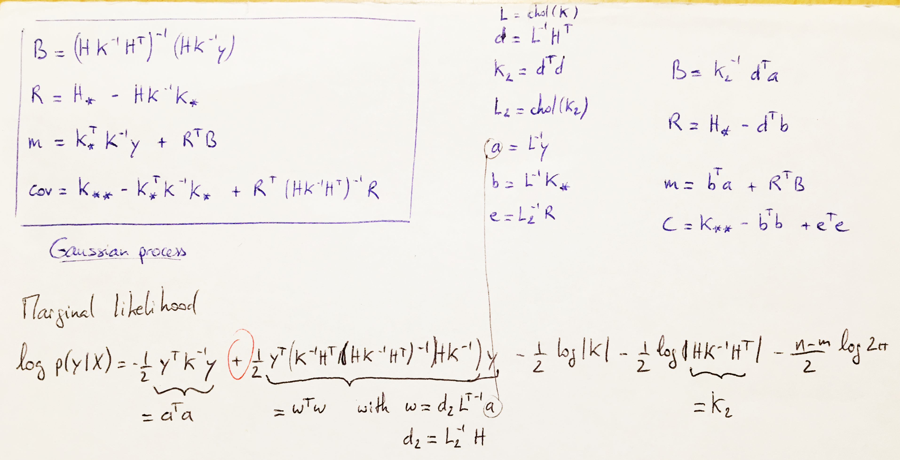

## 1. Cholesky decomposition

The Cholesky decomposition of a Hermitian positive-definite matrix $\mathbf{A}$ is

$$\mathbf{A} = \mathbf{L}\mathbf{L}^T $$

with $L$ a lower triangular matrix .

## 2. Solving and computing with Cholesky decomposition

### 2.a. Solve $A x = b$ for $x$

Solve $A x = b$ for $x$ knowing that $A = LL^T$,
with $L$ a lower triangular matrix.

$$A x = b \Leftrightarrow L (L^T x) = b$$

We write $\alpha = L^T x$.

1. Solve $L \alpha = b$ for $\alpha$ by forward substitution.
2. Solve $L^T x = \alpha$ for $x$ by backward substitution.

### 2.b. Compute $H^T A^{-1} H$
Compute $H^T A^{-1} H$ knowing that $A = LL^T$, 
with $L$ a lower triangular matrix.

$$
\begin{aligned}
  H^T A^{-1} H &= H^T (LL^T)^{-1} H\\
               &= H^T (L^T)^{-1} L^{-1} H\\
               &= (L^{-1} H)^T (L^{-1} H)\\
               &= v^Tv
\end{aligned}
$$

with $v = L^{-1}H$

1. Solve $Lv = H$ for $v$ by forward substitution.
2. Compute the crossproduct $v^Tv$.


### 2.c. Compute $K_\star^T K^{-1} y$
Compute $K_\star^T K^{-1} y$ knowing that $K_\star$ and $K$ are positive-definite,
and $K = LL^T$ with $L$ a lower triangular matrix.

$$
\begin{aligned}
K_\star^T K^{-1} y &= K_\star^T (LL^T)^{-1} y\\
                     &= (K_\star^T(L^T)^{-1})(L^{-1} y) \\
                     &= (L^{-1}K_\star)^T(L^{-1} y)\\
                     &=b^T a
\end{aligned}
$$

with $b = L^{-1}K_\star$ and $a = L^{-1}y$

1. Solve $Lb = K_\star$ for $b$ by forward substitution.
2. Solve $La = y$ for $a$ by forward substitution.
3. Compute the cross-product $b^Ta$!


## 3. Predictions and log marginal likelihood for Gaussian process regression

See book of [Rasmussen and Williams (2006)](http://www.gaussianprocess.org/gpml/), chap. 2, page 19.

Predictive mean: $\bar{f_\star} = K_\star^T (K + \sigma^2 I)^{-1}y$

Predictive variance:  $Var(f_\star) = K_{\star\star}^T  - K_\star^T (K + \sigma^2 I)^{-1}K_\star$

Algorithm of Rasmussen and Williams (2006):

1. $L \leftarrow \text{cholesky}(K + \sigma^2 I)$
2. $\alpha \leftarrow L^T\(L\y)$
3. $\bar{f_\star} \leftarrow K_\star^T \alpha$
4. $v \leftarrow L\K_\star$
5. $Var(f_\star) \leftarrow K_{\star\star} - v^T v$
6. $\log(p(y\mid X)) \leftarrow -\frac{1}{2} y^T \alpha - \sum_i \log L_{ii} - \frac{n}{2}\log 2\pi$

Algorithm of GauProMod, file [GPpred.cpp](https://github.com/emanuelhuber/GauProMod/blob/master/src/GPpred.cpp) (note that here we write $K$ for $(K + \sigma^2 I)$):

1. Compute $L$ with the cholesky decomposition, i.e., 
    ```cpp 
    L = K.llt().matrixL());
    ```
2. We compute $b^T = (L^{-1}K_\star)^T$ by solving $L^Tb^T = K_\star^T$ for $b^T$ (see Section 2.c.1)
    ```cpp 
    bt = (L.triangularView<Lower>().solve(Kstar)).adjoint();
    ```
3. We compute $a = L^{-1}y$ by solving $La = y$ for $a$ (see Section 2.c.2)
    ```cpp 
    a = L.triangularView<Lower>().solve(y);
    ```    
4. We compute the mean of the Gaussian process: $\bar{f_\star} = b^Ta = K_\star^T K^{-1}y$
    ```cpp 
    M = bt * a;
    ```      
5. We compute $K_\star^T (K + \sigma^2 I)^{-1}K_\star = v^T v$ (see Section 2.b)
    ```cpp 
    btb = MatrixXd(kk,kk).setZero().selfadjointView<Lower>().rankUpdate(bt);
    ``` 
6. We compute the covariance of the Gaussian process: $Var(f_\star) = K_{\star\star}^T  - K_\star^T (K + \sigma^2 I)^{-1}K_\star$
    ```cpp 
    C = Kstarstar - vtv;
    ``` 


## 4. Predictions and log marginal likelihood for Gaussian process regression with explicit basis functions

See book of [Rasmussen and Williams (2006)](http://www.gaussianprocess.org/gpml/), chap. 2.7, page 27-29.  

Algorithm of GauProMod, file [GPpredmean.cpp](https://github.com/emanuelhuber/GauProMod/blob/master/src/GPpredmean.cpp):

See my notes...


    
    

## 5. Log determinant of positive definite matrices


<!--
$$\forall x \in R$$
-->
Knowing that:

1. Cholesky decomposition of positive definite matrix $\mathbf{A}$

    $$\mathbf{A} = \mathbf{L}\mathbf{L}^T$$ 

2. determinant of a positive definite matrix $\mathbf{A}$:

    $$
    \begin{aligned}
      \det(\mathbf{A}) &= \det(\mathbf{L}\mathbf{L}^T)\\
              &= \det(\mathbf{L})\det(\mathbf{L}^T)\\
              &= \det(\mathbf{L})^2
    \end{aligned}
    $$


3. log rule

    $$\log \prod_i x_i = \sum_i \log x_i$$
4. determinant of a lower triangular matrix

    $$\det(\mathbf{L}) = \prod_i L_{ii}$$
    
    
the log determinant of positive definite matrices is:

$$
\begin{aligned}    
   \log(\det(\mathbf{A})) &= 2 \log(\det(\mathbf{L}))\\
                          &= 2 \log(\prod_i L_{ii})\\
                          &= 2 \sum_i \log(L_{ii})\\
\end{aligned}
$$


    
Thus to calculate the log determinant of a symmetric positive definite matrix in R:


```r
L <- chol(A)
logdetA <- 2*sum(log(diag(L)))
```

## 6. Determinant od the exponential of a matrix $\mathbf{B}$

$$\det(\exp(\mathbf{B})) = \exp(\mathrm{tr}(\mathbf{B}))$$

See the proof [here](http://applet-magic.com/determinanttheorem.htm)


## Notes

* Kernel:

  * **linear** (implemented as the triangular / linear taper: $K(r)=\sigma^2\max(0,1-r/\ell)$ — commonly called the triangular or linear covariance in spatial literature).
  * **cauchy**: $K(r)=\sigma^2\big(1+(r/\ell)^2\big)^{-\nu}$.
  * **spherical**: compactly supported spherical model: for $r\le \ell$,
    $K(r)=\sigma^2\big(1-\tfrac{3}{2}(r/\ell)+\tfrac{1}{2}(r/\ell)^3\big)$, else 0.
* **Polynomial** and **Linear (dot-product)** kernels are *intrinsically dot-product kernels*, i.e. they depend on inner products (x^\top y), not on distances alone. Because your API supplies a distance matrix `R` (not a Gram matrix), it is **not possible** to compute the standard polynomial or linear dot-product kernels from `R` alone.
  To handle that, separate exported functions that accept a Gram (inner-product) matrix `G` are introduced:

  * `kLinearGram_rcpp(G, h, c, use_symmetry)` implements the linear dot-product kernel: $K(x,y)=\sigma^2 (x^\top y + c)$.
  * `kPolynomialGram_rcpp(G, h, degree, c, use_symmetry)` implements the polynomial kernel: $K(x,y)=\sigma^2 (x^\top y + c)^{p}$.
* For all distance-based kernels implemented `d=0,1,2` the following sign/convention is implemented:

  * `d==0`: kernel value (K(r)).
  * `d==1`: returns `w * (- dK/dr)` (this matches your Gaussian and Matern implementations where the returned expression equals the negative radial derivative multiplied by `w`).
  * `d==2`: returns `- d^2K/dr^2` (the negative second radial derivative) — where meaningful, and for some compact models that have piecewise polynomials (like spherical/triangular) the exact formulas were used inside the compact support; for points where derivatives are not defined (at boundaries) the code uses the analytic interior derivatives (these are the same conventions used for Gaussian above).

Important note about conventions & derivatives

* *same derivative convention*: `d==1` returns `w * (-dK/dr)` and `d==2` returns `-d^2K/dr^2` (mapped into the same "directional weight" form you used earlier for Gaussian). That means the new kernels will plug into your existing pipeline without changing how `w` is used.
* For compactly supported kernels (spherical and triangular/linear) I used the analytic interior derivatives; at the range boundary (r=\ell) derivatives are not smooth — the code returns the interior analytic derivatives (consistent with many spatial implementations). If you want to treat boundary derivatives differently (e.g. set them to 0 or use one-sided limits) tell me and I’ll change it.

Usage notes and examples

* Distance-based kernels (Gaussian, Matern, Cauchy, Spherical, LinearDistance) keep the same API you already used: pass `R` (pairwise distances), `W` (weights used in your derivative formulas), `l`, `h`, `v` (used as shape for Cauchy/Matern), `d` (0,1,2) and `use_symmetry`.
* For dot-product kernels:

  * Use `kLinearGram_rcpp(G, h, c, use_symmetry)` when you already have the Gram matrix (G = X X^\top). `c` is the offset (commonly 0 or 1).
  * Use `kPolynomialGram_rcpp(G, h, degree, c, use_symmetry)` for polynomial kernel. `degree` must be integer (passed as double for API convenience).
* Example R workflow:

  * If you have data `X` (n x p), compute `G <- X %*% t(X)` and call `kPolynomialGram_rcpp(G, h=1.0, degree=3, c=1, TRUE)`.
  * If you have only pairwise distances `R` and want a polynomial kernel you must either reconstruct dot-products (need individual norms) or compute Gram directly from `X`.

Perfect! Here’s a fully documented **RcppEigen version of your linear (Gram) kernel** with derivative support (`d = 0, 1, 2`) and optional symmetry. The derivatives follow the usual convention from your other kernels:

* `d = 0`: $K(X, Y) = h^2 (X Y^T) + b^2$
* `d = 1`: derivative w.r.t each entry — for a linear kernel, this is constant, so we return a matrix of `h^2` scaled by `w`
* `d = 2`: second derivative is zero


The polynomial kernel formula:

$$
K(X, Y) = h^2 \cdot (X Y^\top + c)^{\text{degree}}
$$

Derivative conventions:

* `d = 0`: kernel values.
* `d = 1`: first derivative w.r.t entries: $ dK/dr = h^2 \cdot \text{degree} \cdot (X Y^\top + c)^{\text{degree}-1} $, multiplied elementwise by `w`.
* `d = 2`: second derivative: $ d^2 K/dr^2 = h^2 \cdot \text{degree} \cdot (\text{degree}-1) \cdot (X Y^\top + c)^{\text{degree}-2} $, multiplied elementwise by `w`.


---

## 1. Cauchy Kernel Formula

The **Cauchy kernel** (where $r$ is the distance) is generally defined as:
$$K(r) = h^2 \left(1 + \frac{r^2}{l^2}\right)^{-\nu}$$
Where:
* $r$ is the distance (from `R`)
* $l > 0$ is the length-scale (`l`)
* $h \ge 0$ is the marginal standard deviation scale (`h`)
* $\nu > 0$ is the smoothness parameter (`nu`)

---

## 2. Derivative Analysis

The code correctly implements $K(r)$ for $d=0$ and the derivatives for $d=1$ and $d=2$ based on the chain rule, where $u = r^2/l^2$.

### Case $d=0$ (Kernel $K$)

The formula implemented:
$$K(r) = h^2 \left(1 + \frac{r^2}{l^2}\right)^{-\nu}$$
**Code line:** `Eigen::ArrayXXd arr = h_sq * base.pow(-nu);`
* This is **correct**.

### Case $d=1$ (Weighted First Derivative: $w \cdot (-\frac{dK}{dr})$)

The first derivative is:
$$\frac{dK}{dr} = h^2 \cdot (-\nu) \left(1 + \frac{r^2}{l^2}\right)^{-\nu-1} \cdot \left(\frac{2r}{l^2}\right)$$
$$\frac{dK}{dr} = - h^2 \cdot \left(\frac{2\nu r}{l^2}\right) \left(1 + \frac{r^2}{l^2}\right)^{-\nu-1}$$

The code computes $w \cdot (-\frac{dK}{dr})$, where $w$ is from `W`:
$$w \cdot (-\frac{dK}{dr}) = w \cdot \left[ h^2 \cdot \left(\frac{2\nu r}{l^2}\right) \left(1 + \frac{r^2}{l^2}\right)^{-\nu-1} \right]$$
**Code line:** `Eigen::ArrayXXd arr = w_arr * (h_sq * (2.0 * nu) * r_arr / l_sq) * base.pow(-nu - 1.0);`
* This is **correct**.

### Case $d=2$ (Negative Second Derivative: $-\frac{d^2K}{dr^2}$)

The second derivative $\frac{d^2K}{dr^2}$ involves the product rule on the $\frac{dK}{dr}$ formula (with $C = \frac{2 \nu h^2}{l^2}$):
$$\frac{dK}{dr} = -C \cdot r \cdot \left(1 + \frac{r^2}{l^2}\right)^{-\nu-1}$$
$$\frac{d^2K}{dr^2} = -C \left[ \frac{d}{dr}(r) \cdot \left(1 + \frac{r^2}{l^2}\right)^{-\nu-1} + r \cdot \frac{d}{dr}\left(\left(1 + \frac{r^2}{l^2}\right)^{-\nu-1}\right) \right]$$
$$\frac{d^2K}{dr^2} = -C \left[ \left(1 + \frac{r^2}{l^2}\right)^{-\nu-1} + r \cdot \left((-\nu-1) \left(1 + \frac{r^2}{l^2}\right)^{-\nu-2} \cdot \left(\frac{2r}{l^2}\right)\right) \right]$$
$$\frac{d^2K}{dr^2} = \left[-C \left(1 + \frac{r^2}{l^2}\right)^{-\nu-1}\right] + \left[C \left(\frac{2r^2}{l^2}\right) (\nu+1) \left(1 + \frac{r^2}{l^2}\right)^{-\nu-2}\right]$$

The code implements $\frac{d^2K}{dr^2}$ as `d2`:
* $C = \frac{2 \nu h^2}{l^2}$
    **Code line:** `double C = (2.0 * nu * h_sq) / l_sq;` (Correct)
* Term 1: $-C \left(1 + \frac{r^2}{l^2}\right)^{-\nu-1}$
    **Code line:** `double term1 = -C * base.pow(-nu - 1.0);` (Correct)
* Term 2: $C \left(\frac{2r^2}{l^2}\right) (\nu+1) \left(1 + \frac{r^2}{l^2}\right)^{-\nu-2}$
    **Code line:** `Eigen::ArrayXXd term2 = C * ((2.0 * r_arr.square()) / l_sq) * (nu + 1.0) * base.pow(-nu - 2.0);` (Correct)

The final result is `arr = -d2`, which returns $-\frac{d^2K}{dr^2}$. This is consistent with common practice in some fields (like Gaussian Process regression) where the Hessian is used for uncertainty, and a positive definite covariance matrix may be preferred.
* This is also **correct** based on the comment `// return -d2K/dr2`.

---

## 3. Implementation Details

The C++ / Eigen / Rcpp implementation details are also sound:

1.  **Input Checks:** The checks for identical dimensions of `R` and `W`, the square requirement for `use_symmetry`, and the constraints $l > 0$ and $h \ge 0$ are all **correct** and robust.
2.  **Vectorization:** Using `Eigen::ArrayXXd` for element-wise operations (`.square()`, `.pow()`, arithmetic) is the **correct and fast** way to perform vectorized calculations in Eigen, fulfilling the function's name and purpose.
3.  **Symmetry:** Applying the average `K = (K + K.transpose()) * 0.5` when `use_symmetry` is true is the standard way to enforce numerical symmetry in kernel matrices, which is **correct** for a symmetric kernel like Cauchy, where $K(r_{ij}) = K(r_{ji})$.


The Matérn correlation function $C(d)$ for distance $d$ is:

$$C(d) = \frac{1}{\Gamma(\nu) 2^{\nu-1}} \left( \frac{\sqrt{2\nu} d}{\rho} \right)^\nu K_\nu \left( \frac{\sqrt{2\nu} d}{\rho} \right)$$

where:

  * $d = ||\mathbf{x}_i - \mathbf{x}_j||$ is the Euclidean distance between two points $\mathbf{x}_i$ and $\mathbf{x}_j$.
  * $\rho > 0$ is the **range parameter** (or length-scale).
  * $\nu > 0$ is the **smoothness parameter**.
  * $\Gamma(\cdot)$ is the **Gamma function**.
  * $K_\nu(\cdot)$ is the **Modified Bessel function of the second kind** of order $\nu$.

The key to general $\nu$ is the availability of the **Modified Bessel function $K_\nu$** in C++. Since it is not standard in the C++ math library, we'll use the special functions available through the `R::bessel_k` function (part of the R API that can be called from Rcpp code).

Understanding $\Gamma(\nu)$ and $K_\nu(\cdot)$ is key to grasping how the **smoothness parameter $\nu$** controls the Matérn covariance function.

Here is an explanation of the role of these two special functions in the general Matérn formula:

$$C(d) = \frac{1}{\Gamma(\nu) 2^{\nu-1}} \left( \frac{\sqrt{2\nu} d}{\rho} \right)^\nu K_\nu \left( \frac{\sqrt{2\nu} d}{\rho} \right)$$

---

## The Gamma Function: $\Gamma(\nu)$

The term $\frac{1}{\Gamma(\nu) 2^{\nu-1}}$ serves as a **normalization constant** for the Matérn function.

* **Role:** Its purpose is to ensure that the correlation at distance $d=0$ is exactly 1, i.e., $C(0) = 1$. This is a necessary property for any valid correlation function.
* **Definition:** The **Gamma function** $\Gamma(z)$ is an extension of the factorial function to complex and real numbers. For a positive integer $n$, $\Gamma(n) = (n-1)!$.
* **Effect of $\nu$:** As $\nu$ changes, the magnitude of the Bessel function term $u^\nu K_\nu(u)$ also changes. The Gamma function term compensates for this, keeping the maximum correlation at 1.

---

## he Modified Bessel Function: $K_\nu(u)$

The **Modified Bessel function of the second kind, $K_\nu(u)$**, is the core component that determines the shape of the Matérn correlation function and, consequently, the **smoothness** of the underlying spatial process.

Let $u = \frac{\sqrt{2\nu} d}{\rho}$. The decay of the function $u^\nu K_\nu(u)$ as $d$ increases (and thus $u$ increases) dictates how quickly the correlation drops off.

* **Role:** It mathematically models the correlation decay and the non-differentiability at the origin.
* **The Key to Smoothness:** The value of the smoothness parameter **$\nu$ determines the behavior of the Bessel function near $d=0$**.
    * The spatial process is **$\lfloor \nu \rfloor - 1$ times mean-square differentiable**.
    * **Low $\nu$ (e.g., $\nu=0.5$):** $K_{0.5}(u)$ results in the **Exponential covariance model** (which is not differentiable at the origin, representing a very rough process).
    * **High $\nu$ (e.g., $\nu=2.5$):** $K_{2.5}(u)$ results in a smoother function (the **Matérn 5/2 model**) that is twice differentiable at the origin, representing a much smoother spatial field.
* **Limiting Case:** As $\nu \to \infty$, the Matérn function converges to the infinitely differentiable **Gaussian (or Squared Exponential) covariance function**.

### Summary of $\nu$'s Effect

| $\nu$ Value | Name | Smoothness at Origin ($d=0$) | Differentiability |
| :---: | :---: | :---: | :---: |
| **0.5** | Exponential | Very rough | Not differentiable |
| **1.5** | Matérn 3/2 | Moderately smooth | Once differentiable |
| **2.5** | Matérn 5/2 | Smooth | Twice differentiable |
| $\to \infty$ | Gaussian | Infinitely smooth | Infinitely differentiable |

In essence, **$K_\nu(u)$ is the mathematical engine** that translates the parameter $\nu$ into a correlation function with a specific degree of smoothness. The $\Gamma(\nu)$ term simply scales the function to ensure it starts at 1.

---

### The setup

Suppose you have a **radial kernel**:

$$
K(\mathbf{x}, \mathbf{x}') = k(r), \quad r = |\mathbf{x} - \mathbf{x}'|
$$

where (r) is the Euclidean distance between points.

Now consider a **directional derivative** of the kernel along the vector (\mathbf{x} - \mathbf{x}'):

$$
\frac{\partial K}{\partial \mathbf{x}} = ?
$$

Because (K) depends on (\mathbf{x}) **only through (r)**, we can use the chain rule:

$$
\frac{\partial K}{\partial \mathbf{x}} = \frac{d k}{d r} \cdot \frac{\partial r}{\partial \mathbf{x}}
$$

---

###  Derivative of distance

For Euclidean distance:

$$
r = |\mathbf{x} - \mathbf{x}'| = \sqrt{\sum_i (x_i - x'_i)^2}
$$

the derivative w.r.t. (\mathbf{x}) is:

$$
\frac{\partial r}{\partial \mathbf{x}} = \frac{\mathbf{x} - \mathbf{x}'}{r}
$$

---

### Combine chain rule

$$
\frac{\partial K}{\partial \mathbf{x}} = k'(r) \cdot \frac{\mathbf{x} - \mathbf{x}'}{r}
$$

Notice:

* (k'(r) = \frac{dK}{dr})
* (\frac{\mathbf{x} - \mathbf{x}'}{r}) is a **unit vector pointing away from (\mathbf{x}')**

---

### Introducing the weight (w)

Sometimes, in your implementation, you have a **weight matrix** (W) or a **scaling factor along the radial direction**:

$$
w = \frac{\text{direction vector}}{r} \cdot \text{some scaling factor}
$$

Then the directional derivative along that direction is:

$$
\text{directional derivative} = w \cdot \frac{\partial K}{\partial r} = w \cdot k'(r)
$$

For kernels like Gaussian, (k(r) = \exp(-r^2/(2l^2))), we have:

$$
\frac{dK}{dr} = k'(r) = -\frac{r}{l^2} e^{-r^2/(2l^2)}
$$

so often in **code** it’s implemented as:

$$
w \cdot (-\frac{dK}{dr})
$$

because:

1. (k'(r)) for Gaussian is negative (decreasing function with distance).
2. Multiplying by (-1) gives a **positive scaling along the radial direction**, consistent with gradient-based formulas.
3. (w) encodes the **directional weighting**, e.g., from derivative of the kernel w.r.t. a coordinate.

---

### Summary intuition

* Radial kernels only **depend on distance**, so any derivative w.r.t. coordinates uses **chain rule through (r)**.
* The gradient points **along the vector connecting the two points**.
* The magnitude is (|k'(r)|).
* Multiplying by (w) and sometimes (-1) in code **aligns the sign and scales the derivative properly**.

---

In short:

$$
\text{first derivative along a direction} = w \cdot \left(- \frac{dK}{dr} \right)
$$

* `w` = direction / weight
* `-dK/dr` = ensures positive contribution when kernel decays with distance

This is why in your Rcpp kernels you see the pattern:

```cpp
K = w * (1.0 / l) * common * besK_v_minus_1;
```

…it’s exactly the radial chain rule in action.


Nice — here are the first and second derivatives of the Matérn covariance (with respect to the scalar distance (r)). I’ll state the Matérn in the common form, introduce a short-hand, then give compact, simplified expressions.

**Matérn covariance (isotropic, as a function of distance (r))**
$$
k(r)
= \sigma^2 ,\frac{2^{1-\nu}}{\Gamma(\nu)},
\Big(\frac{\sqrt{2\nu},r}{\ell}\Big)^{!\nu}
K_{\nu}!\Big(\frac{\sqrt{2\nu},r}{\ell}\Big),
\qquad r\ge0,
$$
where (K_\nu) is the modified Bessel function of the second kind, (\nu>0) the smoothness, (\ell>0) the length-scale and (\sigma^2) the variance.

Define
$$
a ;:=; \frac{\sqrt{2\nu}}{\ell},\qquad
C ;:=; \frac{2^{1-\nu}}{\Gamma(\nu)}.
$$
Then (k(r)=\sigma^2 C,(a r)^{\nu}K_{\nu}(a r)=\sigma^2 C a^{\nu} r^{\nu}K_{\nu}(a r)).

---

## First derivative (k'(r)=\dfrac{d}{dr}k(r))

Using the Bessel identity (\dfrac{d}{dx}[x^\nu K_\nu(x)]=-x^\nu K_{\nu-1}(x)) (and chain rule),
$$
\boxed{%
k'(r) ;=; -,\sigma^2, C, a^{\nu+1}, r^{\nu}, K_{\nu-1}(a r)
}
\qquad (r>0).
$$

---

## Second derivative (k''(r)=\dfrac{d^2}{dr^2}k(r))

Differentiating (k'(r)) and simplifying with standard Bessel recurrences gives the compact form
$$
\boxed{%
k''(r) ;=; \sigma^2, C, a^{\nu+1}, r^{\nu-1}!\big[,a r,K_{\nu}(a r);-;K_{\nu-1}(a r),\big]
}
\qquad (r>0).
$$

(One can verify this by expanding the derivative of (r^\nu K_{\nu-1}(a r)) and using
(K'*\mu(z)=-\tfrac12\big(K*{\mu-1}(z)+K_{\mu+1}(z)\big)) and the recurrence relations.)

---

## Useful relations / alternate forms

* In terms of the original parameters,
  $$
  k'(r) ;=; -,\sigma^2 \frac{2^{1-\nu}}{\Gamma(\nu)} \Big(\frac{\sqrt{2\nu}}{\ell}\Big)^{\nu+1} r^{\nu} K_{\nu-1}!\Big(\frac{\sqrt{2\nu},r}{\ell}\Big),
  $$
  $$
  k''(r) ;=; \sigma^2 \frac{2^{1-\nu}}{\Gamma(\nu)} \Big(\frac{\sqrt{2\nu}}{\ell}\Big)^{\nu+1} r^{\nu-1}!\left[\frac{\sqrt{2\nu},r}{\ell}K_{\nu}!\Big(\frac{\sqrt{2\nu},r}{\ell}\Big)-K_{\nu-1}!\Big(\frac{\sqrt{2\nu},r}{\ell}\Big)\right].
  $$
* Special case (\nu=\tfrac12): (K_{1/2}(z)=\sqrt{\tfrac{\pi}{2z}}e^{-z}) and the Matérn reduces to the exponential kernel; the above formulas reduce to elementary exponentials.


Nice — here are the closed forms for the Matérn kernel and its first two derivatives for the three common half-integer smoothness values.
I use the standard shorthand (a=\dfrac{\sqrt{2\nu}}{\ell}) and keep (\sigma^2) for the variance.  For each case I also state (a) explicitly.

---

# (\nu=\tfrac{1}{2})  (exponential kernel)

(a=\dfrac{\sqrt{2\cdot\frac12}}{\ell}=\dfrac{1}{\ell})

$$
\boxed{,k(r)=\sigma^2 e^{-r/\ell},}
$$

$$
\boxed{,k'(r)=-\frac{\sigma^2}{\ell},e^{-r/\ell},}
$$

$$
\boxed{,k''(r)=\frac{\sigma^2}{\ell^2},e^{-r/\ell},}
$$

(Valid for (r\ge0); derivatives written for (r>0) and extend continuously to (r=0).)

---

# (\nu=\tfrac{3}{2})

(a=\dfrac{\sqrt{2\cdot\frac32}}{\ell}=\dfrac{\sqrt{3}}{\ell})

$$
\boxed{,k(r)=\sigma^2\big(1+a r\big)e^{-a r}
;=;\sigma^2\Big(1+\frac{\sqrt{3},r}{\ell}\Big)\exp!\Big(-\frac{\sqrt{3},r}{\ell}\Big),}
$$

$$
\boxed{,k'(r)=-\sigma^2 a^2 r,e^{-a r}
;=; -\sigma^2\frac{3,r}{\ell^2}\exp!\Big(-\frac{\sqrt{3},r}{\ell}\Big),}
$$

$$
\boxed{,k''(r)=\sigma^2 a^2\big(a r-1\big)e^{-a r}
;=; \sigma^2\frac{3}{\ell^2}\Big(\frac{\sqrt{3},r}{\ell}-1\Big)\exp!\Big(-\frac{\sqrt{3},r}{\ell}\Big),}
$$

---

# (\nu=\tfrac{5}{2})

(a=\dfrac{\sqrt{2\cdot\frac52}}{\ell}=\dfrac{\sqrt{5}}{\ell})

$$
\boxed{,k(r)=\sigma^2\Big(1+a r+\tfrac{(a r)^2}{3}\Big)e^{-a r}
;=; \sigma^2\Big(1+\frac{\sqrt{5},r}{\ell}+\frac{5,r^2}{3\ell^2}\Big)\exp!\Big(-\frac{\sqrt{5},r}{\ell}\Big),}
$$

$$
\boxed{,k'(r)=-\sigma^2\frac{a^2 r,(a r+1)}{3},e^{-a r}
;=; -\sigma^2\frac{5,r}{3\ell^2}\Big(\frac{\sqrt{5},r}{\ell}+1\Big)\exp!\Big(-\frac{\sqrt{5},r}{\ell}\Big),}
$$

$$
\boxed{,k''(r)=\sigma^2\frac{a^2\big(a^2 r^2 - a r -1\big)}{3},e^{-a r}
;=; \sigma^2\frac{5}{3\ell^2}\Big(\frac{5,r^2}{\ell^2}-\frac{\sqrt{5},r}{\ell}-1\Big)\exp!\Big(-\frac{\sqrt{5},r}{\ell}\Big),}
$$


